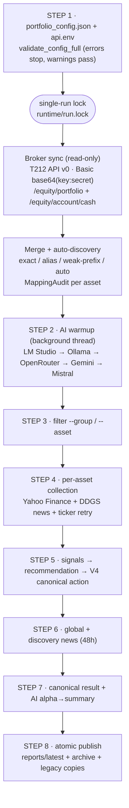

# Portfolio AI Assistant — V4-hardened monolith (final)

Deterministic, **read-only** investment monitoring pipeline with optional local-AI commentary.
It syncs broker positions, enriches them with market data and news, scores every asset
through hard data/mapping gates, and publishes atomic Markdown + JSON reports.

> **Status: final of the V4 monolithic line (pre-1.0).**
> AI never mutates scores or actions — it only summarizes validated facts.
> Analytical output for information only — **not financial advice. No orders are placed by this tool.**

## How it works (pipeline)



Deep dive with per-asset flow, gating tables and file charts: [`docs/ARCHITECTURE.md`](docs/ARCHITECTURE.md).

## Data sources

| Source | What is read | How |
|---|---|---|
| **Trading 212** (optional) | positions (`ticker, quantity, averagePrice, currentPrice, ppl, marketValue, currency`), account cash (`free, invested, pieCash, result, total`), order history, dividends, transactions, pies | `GET`-only REST (`/api/v0/...`), Basic auth `base64(key:secret)`, transient-only retries with `Retry-After` |
| **Yahoo Finance** (`yfinance`) | `regularMarketPrice`, `marketCap`, `volume`, currency; daily history (`days_price_history`, default `3mo`) → change 1d/5d, MA20/50/200, RSI(14), trend, `history_bars`/`last_bar` for staleness | per `yahoo_symbol`; tz cache pinned to `data/cache` |
| **News** (`ddgs`) | per-ticker (`max_news_per_asset`, default 5), global (`max_global_news`, default 20), discovery (`max_discovery_news`, default 20); 48h window (`max_news_age_hours`); keyword sentiment POSITIVE/NEGATIVE/NEUTRAL + source classification | timeout-guarded, in-memory per-run cache, dedup by URL/title |
| **Revolut** (manual) | positions from `REVOLUT_MANUAL_RESEARCH_FILE` (default `data/revolut_research_notes.md`) | `.json` / `.csv` / `.txt` parsed by `load_revolut_data` |
| **PIEs/** | T212 Pie CSV exports + `PIEs/config/*.json` strategy metadata | reference data — the V4 pipeline reads pie positions from the **T212 API** (`get_pies`), not from the CSVs |

## Broker → market mapping (why some assets are blocked)

T212 internal tickers (`WDC_US_EQ`, `000660_KS_EQ`) are normalized by `normalize_t212_ticker`,
then matched against config assets and a built-in T212→Yahoo table plus 23 exchange suffixes
(`_L_EQ→.L`, `_KS_EQ→.KS`, …). Every asset gets a machine-readable `mapping` audit
(`mapping_method`, `mapping_confidence`, `mapping_status`, `is_actionable`).
A broker-vs-market **price gate** warns at ≥15% deviation and blocks at ≥35%
(plus currency-mismatch blocking). Prefix matches are WEAK by design and never actionable alone;
auto-discovered positions without a configured asset stay non-actionable.

**Ticker auto-resolution:** when Yahoo returns no data, the pipeline retries via
built-in table → config `symbol_aliases` → DDGS web search → direct lookup.
Anything still unresolvable is recorded and published as **`failed_tickers.md`**
with ready-to-copy `assets` + `symbol_aliases` JSON for manual config.

## Scoring → canonical actions

Deterministic signals (buy/sell probability, technical + sentiment scores) feed
`calculate_recommendation` (value 30% / momentum 40% / sentiment 30%), then V4 hard gates
decide the final vocabulary: `ADD_CANDIDATE` · `HOLD` · `WAIT` · `REVIEW` ·
`REDUCE_CANDIDATE` · `DATA_UNAVAILABLE` · `REVIEW_MAPPING`
(mapping block → data block → RSI contradiction guards → thresholds with margins;
stop-loss/take-profit levels are informational, short-term group only).

## AI commentary (optional, never decisive)

Backend chain per stage (`ai_chain_alpha`, `ai_chain_summary`, default `[stage, "fallback"]`):
**LM Studio → remote Ollama → OpenRouter → Gemini → Mistral.**
A background warmup probes the chain and preloads the first reachable local model while
data collection runs; dead backends are skipped without re-probing. `run_ai_pipeline`
runs **alpha → optional summary** and appends `## Executive Brief`. Per-backend attempts
are traced into the run manifest. Full AI text lives in
`portfolio_report.json → ai_analysis`; the `.md` dashboard shows only AI provenance
(backend/model/latency).

## Outputs (published atomically)

```text
reports/latest/portfolio_report.md    # daily dashboard: snapshot, attention, action tables
reports/latest/portfolio_report.json  # canonical machine-readable result (+ ai_analysis)
reports/latest/data_quality.md        # mapping/provider audit (technical)
reports/latest/failed_tickers.md      # unresolvable tickers + copy-paste config (only when non-empty)
reports/latest/run_manifest.json      # run metadata: exit code, timings, files, backends
reports/archive/YYYY-MM-DD/<run_id>/  # same files + log snapshot
reports/portfolio_analysis.md/json    # legacy compatibility copies
```

Exit codes: `0` success · `1` fatal · `2` config/env error · `3` already running (lock) ·
`4` partial (report + warnings) · `5` broker sync failed.

## Quick start

```bash
pip install -r requirements.txt
copy api.env.example api.env                      # fill T212 key+secret (read-only!)
copy portfolio_config.example.json portfolio_config.json
py -3.12 portfolio_ai_assistant.py --no-ai        # deterministic report, no AI
py -3.12 portfolio_ai_assistant.py --no-ai --asset AAPL
py -3.12 portfolio_ai_assistant.py                # full run with AI chain
```

Windows helpers: `run_automated.bat` (scheduled, `--scheduled`) · `run_full_report.bat` (AI) ·
`run_t212_analysis.bat` / `run_t212_export.bat` (standalone `python -m trading212.integration` CLI:
`--health`, `--summary`, `--positions`, `--cash`, `--orders`, `--dividends`, `--pies`,
`--analyze`, `--export`).

Pre-flight (offline, secrets redacted):

```bash
py -3.12 portfolio_ai_assistant.py --validate-only   # schema check, exit 2 on errors
py -3.12 portfolio_ai_assistant.py --dry-run --no-ai # full pipeline in memory, no files
py -3.12 -m pytest tests/ -q                         # 55 offline tests
```

All CLI flags: `--config --scheduled --no-ai --no-interactive --validate-only
--check-connectivity --migrate-config --debug --dry-run --group --asset --json-only`.

## Configuration

- `portfolio_config.json` (gitignored; start from `portfolio_config.example.json`):
  `settings` (thresholds, news limits, timeouts, output/runtime dirs),
  `assets[]` (`broker_symbol`, `yahoo_symbol`, `name`, `group`, `search_query`, `aliases`),
  `symbol_aliases` (T212 → Yahoo overrides), `ai_backends` (`alpha`/`summary`/`fallback`
  with `provider`, `base_url`, `model`, `timeout`, `num_ctx`, `temperature`, `api_key`
  supporting `${ENV_VAR}`), `portfolio_rules`.
- `api.env` (gitignored; from `api.env.example`): `TRADING212_*`, `OLLAMA_*`,
  `LM_STUDIO_*`, `OPENROUTER_API_KEY*`, `ODYSSEUS_URL`.

## Runtime guarantees & security

- OS-level single-run lock (`runtime/run.lock`) — overlapping runs exit `3` untouched;
  pair with Task Scheduler *"do not start a new instance"*.
- Atomic publishing (temp file + replace) — `latest/` is never half-written.
- Read-only broker access (GET only); secrets from `api.env` are redacted in logs/reports.
- Never commit `api.env`, `portfolio_config.json`, `logs/`, `reports/`, `runtime/`, `data/cache/`.

## Project structure

```text
portfolio_ai_assistant.py   # pipeline entry (~3.7k lines)
v4_hardening.py             # RunExit/RunLock, atomic writes, MappingAudit, gates, validation
trading212/{auth,portfolio,integration}.py  # standalone read-only T212 package + CLI
tests/test_v4_hardening.py  # 55 offline tests (network fully mocked)
PIEs/                       # pie CSV exports (reference) + config/*.json
docs/{ARCHITECTURE,V4_HARDENING_CHANGELOG,V4_HARDENING_IMPLEMENTATION,releases}.md
```

## License

MIT
