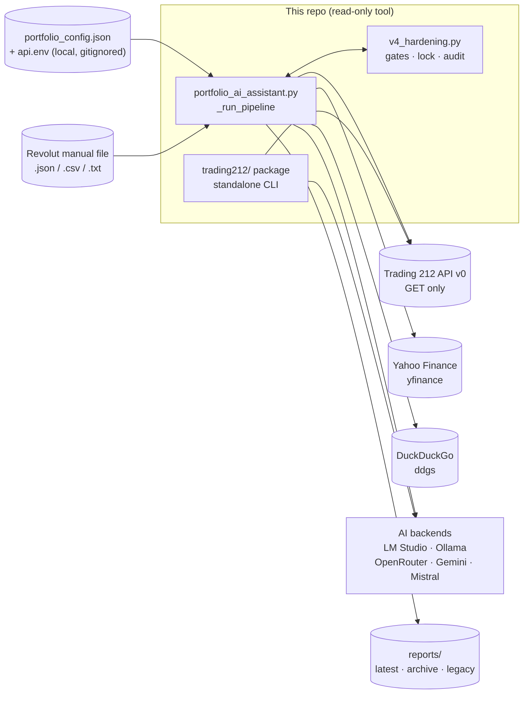
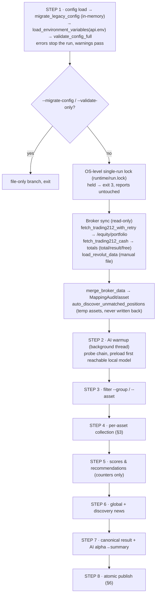
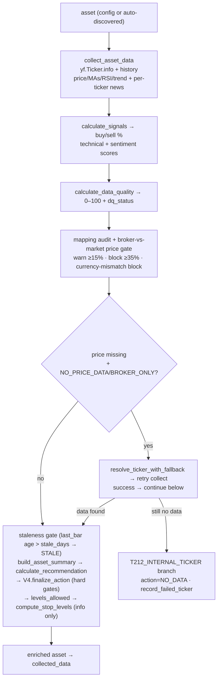
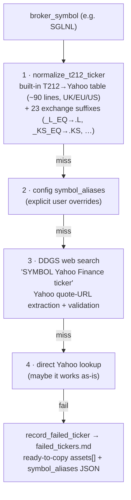
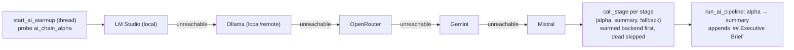

# Architecture & Dataflow — V4-hardened monolith (final)

Single-process pipeline: `portfolio_ai_assistant.py` (~3.7k lines) imports
`v4_hardening.py` (exit codes, lock, atomic writes, mapping audit, gates).
No database, no server, no scheduler inside the repo — scheduling is an external
Windows Task Scheduler job; the standalone `trading212/` package is a separate CLI.

## 1. System context



External reads only. Nothing in the pipeline creates, modifies or cancels broker orders.

## 2. Pipeline (STEP 1–8, exact console order)



## 3. Per-asset flow



Gate order inside `finalize_action`: mapping block → data block → RSI contradiction
guards → threshold logic with margins — yielding
`ADD_CANDIDATE / HOLD / WAIT / REVIEW / REDUCE_CANDIDATE / DATA_UNAVAILABLE / REVIEW_MAPPING`.

## 4. Ticker resolution (4 tiers) + failure report



`failed_tickers.md` is published only when non-empty; its entries also appear
in `data_quality.md` ("Failed ticker resolution"). Config fixes from the report
take effect on the next run.

## 5. AI backend chain



Rules: `api_key` supports `${ENV_VAR}` (values live in `api.env`, redacted everywhere);
reasoning-model output falls back to the `reasoning` field when `content` is empty;
every attempt is traced (`stage/backend/model/ok/latency_s/error`) into the manifest.
Full AI text is stored **only** in `portfolio_report.json → ai_analysis`;
the `.md` dashboard shows AI provenance (backend/model/latency), never scores.

## 6. Publish layout (atomic temp-file + replace)

```text
reports/latest/portfolio_report.md     # dashboard: snapshot, attention, action tables, appendix
reports/latest/portfolio_report.json   # canonical result (assets, mapping, providers, ai_analysis)
reports/latest/data_quality.md         # provider/mapping audit incl. failed tickers
reports/latest/failed_tickers.md       # unresolvable tickers + copy-paste config (if any)
reports/latest/run_manifest.json       # run_id, exit code, timings, files, backends (no secrets)
reports/archive/YYYY-MM-DD/<run_id>/   # same files + log snapshot
reports/portfolio_analysis.md/json     # legacy compatibility copies
```

`--dry-run` runs everything in memory and publishes nothing; `--json-only` skips Markdown.

## 7. Config reference (see `portfolio_config.example.json`)

| Block | Keys (selection) |
|---|---|
| `settings` | `days_price_history` (3mo), `min_history_bars` (14), `stale_days` (7), `buy/sell_probability_threshold` (45/55), `action_*_margin/floor/band`, `rsi_overbought/oversold` (70/30), `mapping_price_warn/block_pct` (15/35), news limits + `max_news_age_hours` (48), `auto_discover_*`, `output_folder`, `runtime_dir`, `ai_warmup_wait` (30), `ai_probe_timeout` (5), load timeouts, `ai_chain_alpha/summary`, `global_news_queries`, `discovery_queries` |
| `assets[]` | `broker_symbol`, `yahoo_symbol`, `name`, `group`, `search_query`, `aliases`, `enabled` |
| `symbol_aliases` | explicit T212 → Yahoo overrides (beat the built-in table) |
| `ai_backends` | `alpha` (lmstudio/fin-r1), `summary` (lmstudio/gemma-4-12b), `fallback` (ollama/gpt-oss-20b); each `provider/base_url/model/timeout/num_ctx/temperature/enabled/api_key` |
| `portfolio_rules` | free-form strategy text injected into the AI prompt |

Secrets (`api.env`, from `api.env.example`): `TRADING212_API_KEY/SECRET`
(read-only pair), `OLLAMA_*`, `LM_STUDIO_*`, `OPENROUTER_API_KEY*`, `ODYSSEUS_URL`.

## 8. Module map

| File | Role |
|---|---|
| `portfolio_ai_assistant.py` | pipeline, providers, scoring, reports, CLI (`--config --scheduled --no-ai --no-interactive --validate-only --check-connectivity --migrate-config --debug --dry-run --group --asset --json-only`) |
| `v4_hardening.py` | `RunExit` (0–5), `RunLock`, atomic writes, `MappingAudit`, action/levels gates, `validate_config_full`, phase timing, secret redaction |
| `trading212/{auth,portfolio,integration}.py` | standalone read-only T212 client + CLI (`--health --summary --positions --cash --orders --dividends --pies --analyze --export`) |
| `tests/test_v4_hardening.py` | 55 offline tests, network fully mocked |
| `PIEs/` | pie CSV exports (local reference) + `config/*.json` strategy metadata |
| `data/` | local caches/notes (`portfolio_performance.toml` tracked; `cache/` gitignored) |
