# Import Graph

> Read-only. Generated 2026-09-24. 109 `.py` files scanned via AST. Secrets not printed.

## Mermaid graph of internal imports

```mermaid
flowchart TD
  CLI[portfolio_ai_assistant] --> SET[investment_engine.config.settings]
  CLI --> ENG[investment_engine.main]
  CLI --> RS[reporting.report_structure]
  CLI --> FT[reporting.failed_tickers]
  CLI -.-> LMSU[providers.lmstudio.unload]

  ENG --> PF[providers.factory]
  ENG --> MD[research.market_data]
  ENG --> MR[research.market_regime]
  ENG --> NE[research.news_engine]
  ENG --> NS[research.news_sources]
  ENG --> PIES[research.pies]
  ENG --> RR[reporting.regime_report]
  ENG --> BF[portfolio.broker_first]
  ENG --> SCH[schemas.ai_recommendations]
  ENG --> CF[accounting.cashflows]
  ENG -.-> R_I[trading212_integration root]
  ENG -.-> R_A[trading212_auth root]
  ENG -.-> R_P[trading212_portfolio root]
  ENG -.-> SYM[portfolio.symbols]
  ENG -.-> PIE_M[portfolio.pie_metadata]

  MR --> NE
  MR --> TA[research.technical_analysis]
  MR --> PV[research.peak_valley]

  BF -.-> R_P
  BF --> SYM

  RR --> SYM
  RR --> MR
  RR --> PV

  DOC[reporting.documents] --> RR
  DOC --> CF
  DOC --> MD
  RS --> RR
  RS --> MD
  IR[reporting.integrated_report] --> EXP[portfolio.exposure]
  IR --> AREP[accounting.reporting]
  IR --> RR

  PF --> B[providers.base]
  PF --> LMS[providers.lmstudio]
  PF --> OLL[providers.ollama]
  PF --> LLC[providers.llamacpp]
  PF --> GEM[providers.gemini]
  PF --> MIS[providers.mistral]
  PF --> ORO[providers.openrouter]
  PF --> ZEN[providers.opencode_zen]
  PF --> FB[providers.fallback]
  LMS --> PRE[providers.presets]

  PIPE[pipeline.engine] --> PF
  PIPE --> PRM[prompts.loader]
  PIPE --> SCO[scoring.priority]
  RANK[prioritization.ranker] --> SCO
  LED[accounting.ledger] --> IMP[accounting.importers.t212_csv]
  LED --> LOT[accounting.lot_matching]
  LED --> PERF[accounting.performance]
  LED --> REC[accounting.reconciliation]
  PERF --> FEES[accounting.fees]

  R_I --> R_A
  R_I --> R_P
  R_P --> R_A
  PKG_I[trading212.integration] --> PKG_A[trading212.auth]
  PKG_I --> PKG_P[trading212.portfolio]
  PKG_P --> PKG_A

  EXPBT_E[experimental.backtest.engine] --> EXPBT_V[validate]
  EXPBT_E --> EXPBT_C[costs]
  EXPBT_E --> EXPBT_M[metrics]
  EXPBT_E --> STRAT[strategy.tech_pie_pullback_v1]
  EXPBT_B[benchmarks] --> EXPBT_C
  EXPBT_B --> EXPBT_M
  EXPBT_CMP[compare] --> EXPBT_IO[io]
  EXPBT_CMP --> EXPBT_V
  EXPBT_CMP --> EXPBT_E
  EXPBT_CMP --> EXPBT_B
  STRAT --> EXPBT_IND[indicators]
  STRAT --> STRATB[strategy.base]

  style ENG fill:#f96
  style RR fill:#fb6
  style BF fill:#9f9
  style EXPBT_E fill:#bbf
```

Deferred (function-level) edges not shown as solid lines but verified: `main.py` ~20 deferred imports of `trading212_*`, `regime_report.*`, `broker_first.*`, `market_data.*`, `fallback.*`; `broker_first.py:677` deferred `trading212_portfolio.*`.

## Circular import risks

| Pair | Verdict | Evidence |
|---|---|---|
| `main ↔ regime_report` | NO CYCLE (one-way) | `main:13-32` + ~10 deferred → `regime_report`; `regime_report:9-16` imports only `market_regime/peak_valley/symbols`. High fan-in, not a cycle. |
| `trading212_portfolio ↔ broker_first` | NO CYCLE (one-way bypass) | `broker_first:677` deferred → `trading212_portfolio.INSTRUMENT_CURRENCY_OVERRIDES`; opposite direction absent. Layering bypass (engine → root legacy), not a cycle. |
| root `trading212_auth ↔ integration ↔ portfolio` | DAG | `integration:23-24` → auth+portfolio; `portfolio:26` → auth. No back edge. |
| package `trading212/auth ↔ integration ↔ portfolio` | DAG | Same shape as root. |
| `accounting/*` | DAG | `ledger` → importers/lot/performance/reconciliation; `performance` → fees; no back edges. |
| `experimental/*` | DAG | `engine/compare/benchmarks/strategy` → `io/validate/costs/metrics/indicators/base`. No back edges. |

Action: no import-cycle fix needed. Fix the **layering bypass** (`main` + `broker_first` → root legacy) in Phase 2.

## Dead / unreferenced Python modules (proven by grep)

| Module | Importers (prod) | Importers (tests) | Verdict |
|---|---|---|---|
| `investment_engine/trading212_integration.py` | 0 | 0 | DEAD placeholder — remove after verification |
| `investment_engine/news/engine.py` | 0 | 0 | DEAD — main uses `research.news_engine` |
| `investment_engine/pipeline/engine.py` | 0 | 0 | DEAD — sole consumer of `prompts` bundle + `memory` |
| `investment_engine/memory/store.py` | 0 | 0 | DEAD — ctor mkdir+writes `memory.json` |
| `investment_engine/discovery/engine.py` | 0 | 1 (`test_news_hardening.py:229`) | TEST-ONLY — move to experimental/tools |
| `investment_engine/reporting/integrated_report.py` | 0 | 3 (`test_integrated_report`, re-export) | TEST-ONLY — move to experimental/tools |
| `investment_engine/portfolio/broker_first_V2415_*.py` | 0 | 0 | GENERATED snapshot — remove |
| `investment_engine/reporting/regime_report_V2415_*.py` | 0 | 0 | GENERATED snapshot — remove |
| `investment_engine/research/news_engine_V2415_*.py` | 0 | 0 | GENERATED snapshot — remove |
| `investment_engine/reporting/failed_tickers_V2415_*.py` | 0 | 0 | GENERATED snapshot — remove |
| `investment_engine/accounting/{models,ledger,lot_matching,fees,performance,reconciliation,reporting,importers}` | 0 in prod (`cashflows` separate) | 5 test files | TEST-ONLY stack — isolate (keep `cashflows`) |
| `investment_engine/prompts/loader.py` + `*.md` | 1 (dead `pipeline`) | 0 | ORPHANED — single registry or remove |

## Modules imported only by tests

- `accounting` ledger stack (above) — `test_transaction_import/ledger`, `test_fee_accounting/analytics`, `test_integrated_report`.
- `discovery.engine.DiscoveryEngine` — `test_news_hardening.py:229` only.
- `pipeline.engine` — nothing (not even tests).
- `trading212_portfolio` root — `test_broker_first.py:260,274`, `test_pie_exposure.py:13,198,209`, `test_pie_hardening.py:5,211` (behavior pins; migrate to canonical imports in Phase 2).
- `main._apply_fail_watchlist_sweep/_portfolio_tickers_for_priority/_build_monitoring_block` — `test_fail_safety.py`, `test_unified_report.py` (private-API coupling; wrap with public helpers in Phase 3).

## Modules with import-time network / file side effects

| Module | Effect at import | Severity |
|---|---|---|
| `investment_engine/config/settings.py:12-13` | `load_dotenv()` + `load_dotenv("api.env")` — secrets into `os.environ` | MEDIUM — move to explicit `load()` call |
| `trading212_portfolio.py:28-31` | `logging.basicConfig(...)` — mutates global root logger | LOW — remove (let CLI own logging) |
| `investment_engine/memory/store.py:11-18` | ctor (not import) mkdir+writes `memory.json` | LOW (dead code) |
| `experimental/*` | none at import (`subprocess` only inside `compare._get_code_version`) | NONE |
| all providers | none at import (`requests.get` only inside `_is_available`/`generate`) | NONE |

## Modules importing optional dependencies unsafely

| Module | Import | Safe? |
|---|---|---|
| `research/technical_analysis.py:13-18` (`pandas_ta`) | `try/except ImportError`, `HAS_PANDAS_TA` | SAFE (narrow) |
| `research/technical_analysis.py:22-27` (`talib`) | `try/except ImportError`, `HAS_TALIB` | SAFE (narrow) |
| `research/technical_analysis.py:52-61` (`finvizfinance`) | `try/except ImportError` + kill-switch `_FINVIZ_DISABLED` | SAFE |
| `research/peak_valley.py:9` (`scipy.signal.find_peaks`) | hard import, no flag | UNSAFE if scipy missing — pin `scipy` required (already in requirements) |
| `research/market_data.py:425-457` Playwright scrapes | bare `except:` (E722) | UNSAFE style — catches `KeyboardInterrupt`; narrow to `Exception` |
| `discovery/engine.py:5-8` | `except Exception → None` then later call | UNSAFE — masks all errors; fail loud or gate |
| `config/settings.py:21-26` strategy JSON | `except Exception → default` | WEAK — masks JSON errors; log warning |
| `install_requirements.bat:49` | `find_spec` (no import) | SAFE |

Note: `requirements.txt` comments out `pandas-ta`/`ta-lib`, but this PC's Python 3.12 site-packages HAS `pandas_ta` installed (pytest `Pandas4Warning`) — cross-PC indicator divergence. See `ENVIRONMENT_DIAGNOSTIC.md`.
