# Project Architecture Audit

> Read-only audit. No production code modified. Generated 2026-09-24.
> Repo: `C:\Users\DracieVajko\Downloads\PC_Commands\AI\portfolio_ai_assistant`
> Methods: full tree scan, AST import extraction (109 `.py` files), `pytest --collect-only` (313 tests),
> full offline suite `tests/` (261 passed) + `experimental/tests/` (52 passed), grep for reconciliation/FX/providers/news/reports,
> targeted reads of entrypoints, broker-first, providers, research, reporting, accounting, experimental, config/bats.
> Secrets never printed; `api.env` existence checked only.

## Executive Summary

### What the project currently does

Python portfolio-intelligence assistant (read-only Trading 212 + market/tech/regime/news research + local/cloud LLM chain + deterministic reports):

1. Fetches Trading 212 account (`/equity/account/cash` + `/equity/portfolio`) via `trading212_integration.create_integration(config_file="api.env")` (`investment_engine/main.py:96-140`).
2. Builds a broker-first snapshot (`investment_engine/portfolio/broker_first.py:build_account_snapshot:504`) with ISIN/catalog FX, GBX/100, dedupe, and `reconcile_snapshot:723`.
3. Builds unified portfolio rows (`investment_engine/reporting/regime_report.py:build_unified_portfolio_rows:389`) keyed by display symbol, with canonical BUY/SELL/HOLD signals, technicals, earnings radar, and fail-safety gates.
4. Fetches parallel news (Strict + Enhanced + Slovak + Reddit + Trump + commodity + analyst) with 48h filter (`investment_engine/main.py:_fetch_all_news_parallel:143-248`), technicals via yfinance, EXI2 regime (`research/market_regime.py`), earnings via Yahoo, FinViz fundamentals (US only).
5. Runs chained LLM (`providers/factory.py:ProviderFactory`, `providers/fallback.py:ChainedFallbackProvider`): LM Studio -> llama.cpp -> Ollama -> Gemini -> Mistral (OpenRouter/Zen explicit only), with deterministic fallback per stage.
6. Renders human brief + broker snapshot + machine JSON + AI context + diagnostics, published atomically (`portfolio_ai_assistant.py:write_reports:66-128` + `reporting/report_structure.py` debug/AI-context/human layers).

### What appears production-ready

- Broker-first core: `broker_first.py` (dedupe, GBX, FX hierarchy, `reconcile_snapshot`, diagnostic CSV/MD) — covered by `tests/test_broker_first.py` (21 tests) and `test_reconciliation_consistency.py` (19 tests), all passing.
- Unified report + fail-safety: `regime_report.py` canonical signals, `apply_trade_safety`, `compute_reconciliation`, priority table, FAIL watchlist sweep — covered by `test_unified_report.py` (46), `test_fail_safety.py` (18), `test_documents.py` (20).
- Account performance (broker-equity, `accounting/cashflows.py`) — covered by `test_account_performance.py` (18).
- Provider chain + presets + breaker — covered by `test_model_routing.py`, `test_model_presets.py`, breaker part of `test_unified_report.py`.
- Experimental backtest isolation + no-look-ahead + costs + FX + reproducibility — covered by 52 experimental tests, all passing.

### What is experimental

- `experimental/backtest/` strategy `tech_pie_pullback_v1` + benchmarks/compare/validate/io/metrics — explicitly research-only per `experimental/README.md`; zero imports either direction (verified by grep); must stay separate.
- `investment_engine/accounting/` CSV-ledger stack (`ledger`, `lot_matching`, `fees`, `performance`, `reconciliation`, `reporting`, `importers/t212_csv`) — only `cashflows.py` is called by production (`main.py:2058`); the rest is tests-only / prepared for an unwired `--ledger` flow.
- `investment_engine/pipeline/engine.py` (`InvestmentPipeline`), `investment_engine/news/engine.py` (`normalize_news`), `investment_engine/memory/store.py`, `investment_engine/discovery/engine.py` (only test importer), `investment_engine/trading212_integration.py` (dead placeholder), `investment_engine/reporting/integrated_report.py` (`generate_full_integrated_report` — no production caller), legacy `AIContextBuilder` (superseded by `AIContextReportBuilder`).

### Top 10 architecture risks

1. **No `.gitignore`; no commits.** `git status` = all `??` including `api.env`, `reports/`, `data/cache/`, `logs/`. `README.md:76` claim "api.env gitignored" is false. One `git add .` commits live secrets + broker dumps.
2. **Three parallel reconciliation semantics.** Legacy `trading212_portfolio.py:493-495` (`max(€1,0.1%)`, abs, no dedupe) vs canonical `broker_first.py:757-780` (`min(0.1%,€2)`, signed, ISIN dedupe, UNKNOWN) vs report `regime_report.py:145-199` (inherits summary status or recomputes) vs ledger `accounting/reconciliation.py` (deposits €10 / positions 5%). At equity ~€3246 a €2.50 delta is PASS legacy, FAIL canonical. Both statuses are exposed (`reconciliation_status` + `reconciliation_v2`).
3. **Dedupe-key divergence.** Canonical dedupes by `(account,ISIN)` else `(account,broker_id)`; unified rows dedupe by `symbol.upper()` (broker ticker). Same ISIN under two tickers (e.g. `VWSBd_EQ`+`VWSB`) counts once canonically, twice in report rows.
4. **README/runtime drift.** README documents `--scheduled/--validate-only/--dry-run/--no-ai/--asset`, exit codes 0-5, `runtime/run.lock`, `reports/latest/portfolio_report.md + data_quality.md`, `archive/YYYY-MM-DD/<run_id>/`. None exist in `portfolio_ai_assistant.py:131-136` (only `--config/--investment-engine/--generate-full-report`, exits 0/1/2, no lock). `reports/latest/*` is a stale V4 layout that disagrees with current `write_reports` outputs.
5. **Provider attribution gap.** Reports show configured `decision_model/writer_model`; `ChainedFallbackProvider` strips `context["model"]` (`fallback.py:143`), locals ignore it, and `manifest["provider"]` is actually `brief_metadata.stance` (`portfolio_ai_assistant.py:115`). Real winner/model per stage is not recorded.
6. **Indicator-engine divergence across machines.** `requirements.txt` comments out `pandas-ta`/`ta-lib`; production effectively always uses manual SMA-based RSI/ATR/ADX + static Supertrend, while pandas-ta path (if installed) yields Wilder/stateful/Keltner differences, and `market_data.py` uses `ewm(adjust=True)` vs `adjust=False`, and experimental backtest uses correct Wilder/stateful as reference. Same ticker can score differently per PC.
7. **Legacy T212 shadow layers.** Root `trading212_*.py` (743/448/432 lines) vs `trading212/` package (286/448/237 lines) are diverged copies; `trading212/portfolio.py` has no reconciliation/FX/catalog; `main.py` imports root modules directly (`main.py:96,461,934,1055,2069`), bypassing both `trading212/` and dead `investment_engine/trading212_integration.py`. `broker_first.py:677` deferred-imports root `trading212_portfolio` for overrides (layering bypass, not a cycle).
8. **Ticker-heuristic value risk (contained but real).** Legacy `_resolve_instrument_currency` maps `fxPpl≈0→EUR` and `_EQ→GBX`; canonical layer rejects both (`CURRENCY_UNRESOLVED`). Yahoo mapping is gated (`support_state`), but `to_display_symbol` suffix/prefix stripping and alias precedence must stay single-sourced in `symbols.py`.
9. **Pervasive broad `except Exception` (by design, but noisy).** 150+ sites (`main.py` ~70, `news_engine.py` ~20, `web_researcher.py`, `trading212_*.py`); plus bare `except:` in `market_data.py:425-457` (catches `KeyboardInterrupt`). Failures degrade to partial reports instead of surfacing.
10. **Latent bugs + dead snapshots.** `write_reports` references undefined `logger` on archive-copy failure (`portfolio_ai_assistant.py:100,123` → `NameError`); duplicated `_is_us_symbol`/`_symbol` in `main.py`, duplicated `_collect_data_quality_flags` in `report_structure.py`; 4 `*_V2415_Sep-24-1106-2026_1.py` snapshots (~3800 lines) + 2 cache `*_V2415_*.json` with zero importers.

### Top 10 cleanup opportunities

1. Create `.gitignore` (secrets, reports, data/cache, logs, runtime, caches) + first commit — highest leverage, lowest risk.
2. Delete 4 `*_V2415_*.py` snapshots (proven zero importers) after hash-verifying current files are newer (they add `to/from_reconciliation_dict`, Slovak news, `HELD_UNRESOLVED`, news-context section).
3. Consolidate T212 layers: keep canonical `broker_first.py` + `symbols.py`; demote root `trading212_portfolio.py` R1 to compatibility shim or remove; delete dead `investment_engine/trading212_integration.py`; decide `trading212/` package fate (currently shadow without recon/FX).
4. Unify reconciliation on one function (`broker_first.reconcile_snapshot`); make `regime_report.compute_reconciliation` a thin view over it; document ledger `reconcile_ledger` as historical-only.
5. Unify dedupe key (ISIN-first everywhere, including unified rows).
6. Fix README vs runtime (either implement `--scheduled/--validate-only/--dry-run`, lock, exit 3/4/5, `latest/` layout — or rewrite README to match `write_reports` reality) and remove/refresh stale `reports/latest/*`.
7. Fix provider attribution: propagate winner model per stage into `model_info`/`brief_metadata`/manifest; fix `manifest["provider"]` mislabel; wire or drop `context["model"]` in chain.
8. Choose one production indicator engine (manual, pinned + documented) + one reference (experimental Wilder/stateful); pin `pandas/numpy/scipy`, document `pandas-ta`/`talib` as validation-only, align `adjust=False` everywhere.
9. Isolate `accounting/` ledger stack to `experimental/` or `tools/` (keep `cashflows.py` in production); remove or wire `integrated_report.py`, `InvestmentPipeline`, `news/engine.py`, `memory/store.py`.
10. Fix small defects: `write_reports` logger, duplicated helpers, `manifest provider`, bare `except:`, `zoneinfo` tzdata note for Windows.

### What must not be changed until tested

- `investment_engine/portfolio/broker_first.py` (snapshot, FX, dedupe, reconcile, diagnostics) — 21 + 19 tests pin it.
- `investment_engine/portfolio/symbols.py` — every display/Yahoo/support decision flows through it.
- `investment_engine/reporting/regime_report.py` canonical signals / unified rows / trade-safety / priority / FAIL sweep — 46 + 18 + 20 tests.
- `investment_engine/accounting/cashflows.py` — broker-equity performance + `FAIL_PERFORMANCE_NOTE` used by brief/snapshot.
- Provider chain order + breaker + presets (`factory.py`, `fallback.py`, `presets.py`, `lmstudio.py`) — routing tests pin payloads.
- `portfolio_config.json` thresholds/weights/queries + `PIEs/*.csv` + `strategy.json` — behavior changes without code diff.
- Anything touching quantity/price/P&L/equity/cash/FX/reconciliation status until the unified-recon + dedupe-key decisions are locked and the new tests from §Test Audit are added.

## Repository Tree

Excludes `.git/`, `__pycache__/`, `.pytest_cache/`, no `node_modules`/venvs in repo. Generated/caches/secrets marked `(G)`/`(C)`/`(S)`.

```text
portfolio_ai_assistant/
  portfolio_ai_assistant.py        # production CLI entrypoint (argparse + atomic publish + manifest)
  portfolio_config.json            # assets, symbol_aliases, settings (provider/models/regime/news/pies)
  requirements.txt                 # core + commented optional (pandas-ta, ta-lib, torch)
  README.md                        # partly drifted (see risks §4)
  EXI2_MARKET_REGIME_PLAN.md       # regime design note
  ROBUST_EXI2_REGIME_SPEC.md       # regime spec
  .git/                            # repo with zero commits; no .gitignore (CRITICAL)
  api.env                     (S)  # live T212 keys; UNIGNORED — must fix first
  cleanup.bat / install_requirements.bat / run_*.bat  # Windows launchers (py -3.12)
  accounting/                      # only manual_adjustments.example.json (template)
  PIEs/                            # 5 pie CSVs + config/*.json (pie universe inputs)
  investment_engine/
    __init__.py
    main.py (2722 lines)           # GOD MODULE: full run_engine pipeline
    config/settings.py + strategy.json  # EngineSettings, MarketRegimeSettings, env/api.env loading
    portfolio/ broker_first.py (CANONICAL) + broker_first_V2415_*.py (dead snapshot)
               symbols.py (CANONICAL mapping) + pie_metadata.py + exposure.py + sidecar.py
    research/ market_data.py + technical_analysis.py + peak_valley.py + market_regime.py
              news_engine.py + news_engine_V2415_*.py (dead) + news_sources.py
              web_researcher.py + pies.py + sector_templates.py
    providers/ base/factory/fallback/lmstudio/ollama/llamacpp/gemini/mistral/openrouter/opencode_zen/presets
    reporting/ regime_report.py (CANONICAL report, 1818 lines) + regime_report_V2415_*.py (dead)
               documents.py (render_brief/render_snapshot) + report_structure.py (debug/AI/human layers)
               integrated_report.py (no prod caller) + failed_tickers.py + failed_tickers_V2415_*.py (dead)
    accounting/ cashflows.py (PROD) + models/ledger/lot_matching/fees/performance/reconciliation/reporting (tests-only)
               + importers/t212_csv.py + README.md
    schemas/ai_recommendations.py  # weak Pydantic (Any lists) + parse/sanitize
    discovery/engine.py (test-only) + pipeline/engine.py (dead) + news/engine.py (dead)
    memory/store.py (dead) + scoring/priority.py + prioritization/ranker.py
    prompts/ loader.py + 6 *.md (used only by dead InvestmentPipeline; main uses inline prompts)
    trading212_integration.py      # DEAD placeholder (Bearer api.trading212.com)
  trading212/                      # SHADOW package: auth/integration/portfolio/__init__ (diverged copies)
  trading212_auth.py / trading212_integration.py / trading212_portfolio.py  # root legacy+bridge (ACTIVE via main.py)
  tests/ (19 files, 261 tests) + conftest.py + fixtures/t212_transactions_sanitized.csv
  experimental/ README.md + backtest/{engine,indicators,costs,benchmarks,compare,validate,io,metrics,strategy/*}
                + tests/ (8 files, 52 tests) + backtest/config/*.json
  reports/ (G)  portfolio_decision_brief.md, t212_portfolio_snapshot.md, portfolio_analysis.json,
                run_manifest.json, failed_tickers.md, raw_endpoint_dump_*.json, ai_context*,
                ai_context/, archive/, debug/<run_id>/, latest/ (STALE V4), summary/
  data/ (C)     cache/{t212_raw_snapshot_*.json (~50), news_google_rss*.json, t212_cashflow_history*.json,
                t212_instruments.json, cookies.db*, kr-tz.db*, web/} + portfolio_performance.toml
  logs/ (G)     portfolio_*.log + latest_run.log (hardlink w/ copy fallback)
  runtime/      run.lock (stale; unchecked by current code)
```

## Entrypoints

| Path | Invocation | Imports | Workflow | Files written | Network/API | Status |
|---|---|---|---|---|---|---|
| `portfolio_ai_assistant.py:main:131` | `py -3.12 portfolio_ai_assistant.py [--config X] [--investment-engine] [--generate-full-report]` | `config.settings.EngineSettings`, `main.run_engine`, `reporting.report_structure` (5 fns), deferred `reporting.failed_tickers`, `providers.lmstudio.unload` | logging → `setup_debug_layer(run_id)` → settings → `run_engine` → 7-key brief-contract check → `generate_human_brief` → `write_human_brief` → `render_failed_tickers_md` → atomic `write_reports` → `save_ai_context_layer` → `move_debug_outputs` → LM-Studio unload | `reports/{portfolio_decision_brief.md,t212_portfolio_snapshot.md,portfolio_analysis.json,failed_tickers?.md,run_manifest.json}` + archive copies + `summary/portfolio_brief.md` + `ai_context/` + `debug/<run_id>/` | indirect via `run_engine` (T212, yfinance, RSS, FinViz, LLM) | **production** (sole current CLI) |
| `investment_engine/main.py:run_engine:393` | library (called by wrapper only) | `providers.factory`, `research.*`, `reporting.regime_report`, `portfolio.broker_first`, `schemas.*` + ~20 deferred (`trading212_integration`, `trading212_auth`, `trading212_portfolio`, `accounting.cashflows`, …) | T212 fetch → raw diag dump → recon guard → news‖ → earnings → regime → AI recs → canonical signals → LLM decision/PIE/discovery/summary → unified rows → earnings radar → snapshot+recon → trade safety → priority → diagnostics → FAIL sweep → regime parts → AI context → brief+snapshot dict | `reports/reconciliation_diagnostic.{csv,md}` (transient), `reports/ai_context_<ts>.md`, `reports/news_context_*.md` | T212 REST, Yahoo, Google/Slovak/Reddit RSS, FinViz, all LLM providers | **production core** (god module) |
| `trading212_integration.py:create_integration` + `trading212/integration.py` | `create_integration(config_file="api.env")` from `main.py:100,461,2069` | `trading212_portfolio.PortfolioMonitor` | read-only broker sync | none directly | T212 REST | **production lib / wrapper** |
| `trading212_portfolio.py:PortfolioMonitor` (root) | imported by `main.py:934,1055`, `broker_first.py:677`, 4 test files | `trading212_auth`, `yfinance`, `broker_first` (deferred both directions — bypass, not cycle) | `parse_position`, FX, catalog, R1+v2 recon | `data/cache/t212_instruments.json` | T212 + Yahoo FX | **active-bridge / legacy-candidate (R1 part)** |
| `investment_engine/reporting/integrated_report.py:generate_full_integrated_report` | no production caller (tests + re-export only) | `portfolio.exposure`, `accounting.reporting` | exposure+actionability+ledger+regime strings | none (pure) | none | **dead in production** |
| `experimental/backtest/compare.py` | `python -m experimental.backtest.compare --config …` | `io,validate,costs,metrics,benchmarks,engine` | local comparison run | `experimental/reports/comparison_*` only | none (enforced by tests) | **experimental** |
| `run_full_report.bat` etc. | `py -3.12 portfolio_ai_assistant.py --config portfolio_config.json --investment-engine --generate-full-report` | — | launcher | via CLI | via CLI | **compatibility wrapper** |

Notes: argparse implements only 3 flags; README's `--scheduled/--validate-only/--dry-run/--no-ai/--asset` do not exist. Exit codes implemented: 2 (config), 1 (LLM-marker/exception), 0 (ok). README's 0-5 + lock are aspirational. `write_reports` is atomic (`tmp+fsync+os.replace`, sha256 manifest) but has a latent `logger` NameError on archive-copy failure (`portfolio_ai_assistant.py:100,123`).

## Module Map

109 `.py` files (excl. caches). Full AST census (lines/classes/functions/imports) was extracted during audit; key modules below. Status: CANONICAL / ACTIVE / COMPATIBILITY_WRAPPER / EXPERIMENTAL / LEGACY_CANDIDATE / GENERATED / UNKNOWN.

### Production core (CANONICAL / ACTIVE)

- `portfolio_ai_assistant.py` (282L) — CLI, atomic publish, manifest. ACTIVE. No import side effects beyond logging setup at call time.
- `investment_engine/main.py` (2722L, 68 fns) — GOD MODULE, fan-out 8 top + ~20 deferred. ACTIVE. Network: T212/yfinance/RSS/FinViz/LLM. Writes: diagnostics + AI/news context. Imports root T212 modules directly (bypass).
- `investment_engine/portfolio/broker_first.py` (1109L, 8 classes, 28 fns) — CANONICAL broker model/FX/dedupe/recon/diagnostics. No import side effects; `get_live_fx_rates` cached (TTL 3600).
- `investment_engine/portfolio/symbols.py` (466L, 14 fns) — CANONICAL broker↔display↔Yahoo + support gating. ACTIVE, pure.
- `investment_engine/reporting/regime_report.py` (1818L, 52 fns) — CANONICAL report (canonical signals, unified rows, recon view, safety, priority, AI context). ACTIVE, pure builders.
- `investment_engine/reporting/documents.py` (560L) — `render_brief:340`, `render_snapshot:444`, monitoring/ideas. ACTIVE, pure.
- `investment_engine/reporting/report_structure.py` (505L) — debug/AI-context/human layers, paths, retention. ACTIVE. File writes on call (not import).
- `investment_engine/reporting/failed_tickers.py` (135L) — `collect/render_failed_tickers_md` with HELD_UNRESOLVED filter. ACTIVE.
- `investment_engine/research/news_engine.py` (1195L, 49 fns) — `StrictNewsFetcher`, tiers, dedupe, decision filter. ACTIVE. Network on call; file JSON cache (TTL 6h).
- `investment_engine/research/news_sources.py` (620L) — `EnhancedNewsFetcher` + `NewsContextBuilder`. ACTIVE. Network on call.
- `investment_engine/research/market_data.py` (511L) — Yahoo gate/registry, yfinance technicals, headlines/earnings/consensus, Playwright fallback. ACTIVE. Network on call.
- `investment_engine/research/technical_analysis.py` (719L) — manual vs pandas-ta indicators + FinViz. ACTIVE. Optional imports guarded (`ImportError` only).
- `investment_engine/research/market_regime.py` (562L) — EXI2 multi-TF classify. ACTIVE. Network (yfinance) on call.
- `investment_engine/research/peak_valley.py` (477L) — `find_peaks` extrema/levels/Fibonacci. ACTIVE. Hard `scipy` import.
- `investment_engine/research/web_researcher.py` (776L) — Playwright Finviz/EarningsHub/TradingView/Finquota. ACTIVE but earnings path not wired to main news-parallel.
- `investment_engine/research/pies.py`, `sector_templates.py` — pie universe + sector queries. ACTIVE.
- `investment_engine/providers/` (11 files) — `base`, `factory:223L` (chain), `fallback:183L` (breaker), `lmstudio:230L` (presets/warmup/unload), `ollama/llamacpp/gemini/mistral/openrouter/opencode_zen`, `presets`. ACTIVE. Network on call; `factory._is_available` probes locals (timeout 3s).
- `investment_engine/config/settings.py` (311L) — `EngineSettings/MarketRegimeSettings`, `load_dotenv()+load_dotenv("api.env")` **at import** (secret side effect). ACTIVE.
- `investment_engine/accounting/cashflows.py` (641L) — sole accounting module called by production (`main.py:2058`). ACTIVE. Network: historical FX via yfinance.
- `investment_engine/portfolio/pie_metadata.py`, `exposure.py`, `sidecar.py` — pie universe/exposure/actionability. ACTIVE/SUPPORTING, pure.
- `investment_engine/schemas/ai_recommendations.py` (265L) — weak Pydantic (`Any` lists), parse/validate; `sanitize_ai_output` dead. ACTIVE with gaps.
- `investment_engine/scoring/priority.py` + `prioritization/ranker.py` — deterministic scoring. ACTIVE (via ranker; confirm caller before touching).
- `trading212_auth.py` (432L), `trading212_integration.py` (448L), `trading212_portfolio.py` (743L) — root bridge. ACTIVE-BRIDGE; R1 recon + heuristics are LEGACY_CANDIDATE, v2 delegation + FX/catalog are ACTIVE.
- `trading212/auth.py` (237L) — ACTIVE auth client (retry 3 vs root 5; root adds tx-history cursor + raw-dump).

### Wrappers / compat

- `run_*.bat`, `cleanup.bat`, `install_requirements.bat` — COMPATIBILITY_WRAPPER (pin `py -3.12`).
- `investment_engine/portfolio/__init__.py`, `reporting/__init__.py`, `research/__init__.py`, `accounting/__init__.py` — re-exports. ACTIVE.

### Experimental

- `experimental/backtest/{engine,indicators,costs,benchmarks,compare,validate,io,metrics,strategy/*}` + `experimental/tests/` (8 files) — EXPERIMENTAL, isolated both directions, no network. See §Experimental Module Audit.

### Legacy candidates / dead / unknown

- `trading212/portfolio.py` (286L, no recon/FX/catalog), `trading212/integration.py:OllamaClient` + root twin (byte-identical legacy AI bridge, orphaned from `run_engine`), `trading212/__init__.py` re-export — LEGACY_CANDIDATE/SHADOW.
- `investment_engine/trading212_integration.py` (86L, wrong `Bearer api.trading212.com`) — DEAD (zero importers).
- `investment_engine/news/engine.py` (`normalize_news`), `pipeline/engine.py` (`InvestmentPipeline`), `memory/store.py` (`MemoryStore`, mkdir+write in ctor), `discovery/engine.py` (only test importer) — DEAD or tests-only.
- `investment_engine/reporting/integrated_report.py`, legacy `AIContextBuilder` — dead in production.
- `*_V2415_Sep-24-1106-2026_1.py` ×4 + 2 cache `*_V2415_*.json` — GENERATED snapshots, zero importers, diverged (current files are newer).
- `investment_engine/accounting/{models,ledger,lot_matching,fees,performance,reconciliation,reporting,importers}` — tests-only / future `--ledger` (UNKNOWN until wired or moved).
- `investment_engine/prompts/*` — UNKNOWN (used only by dead `InvestmentPipeline`; main uses inline prompts).

Side effects on import: `settings.py` dotenv loading; `trading212_portfolio.py:28-31` `logging.basicConfig` (global logger mutation). No network/file writes at import elsewhere (local probes happen at call time).

## Dependency Graph

```mermaid
flowchart TD
  CLI[portfolio_ai_assistant.py] --> SET[config.settings]
  CLI --> ENG[main.run_engine]
  CLI --> RS[reporting.report_structure]
  CLI --> FT[reporting.failed_tickers]
  ENG --> PF[providers.factory]
  ENG --> MD[research.market_data]
  ENG --> MR[research.market_regime]
  ENG --> NE[research.news_engine]
  ENG --> NS[research.news_sources]
  ENG --> PIE[research.pies]
  ENG --> RR[reporting.regime_report]
  ENG --> BF[portfolio.broker_first]
  ENG --> SCH[schemas.ai_recommendations]
  ENG -.->|deferred| R_T212[trading212_integration root]
  ENG -.->|deferred| R_AUTH[trading212_auth root]
  ENG -.->|deferred| R_PF[trading212_portfolio root]
  ENG --> CF[accounting.cashflows]
  MR --> TA[research.technical_analysis]
  MR --> PV[research.peak_valley]
  MR --> NE
  BF -.->|deferred overrides| R_PF
  BF --> SYM[portfolio.symbols]
  RR --> SYM
  RR --> MR
  RR --> PV
  DOC[reporting.documents] --> RR
  RS --> RR
  PF --> LMS[providers.lmstudio]
  PF --> OLL[providers.ollama]
  PF --> LLC[providers.llamacpp]
  PF --> GEM[providers.gemini]
  PF --> MIS[providers.mistral]
  PF --> ORO[providers.openrouter]
  PF --> ZEN[providers.opencode_zen]
  PF --> FB[providers.fallback]
  EXP[experimental.backtest] -.->|no edge| ENG
  LED[accounting ledger stack] -.->|no prod edge| ENG
```



- Circular imports: **none proven.** `main→regime_report` is one-way; `broker_first→trading212_portfolio` is one-way deferred (bypass, not cycle); root `trading212_*` form a DAG.
- High fan-in: `portfolio.symbols`, `reporting.regime_report`, `research.market_data`, `research.news_engine`, `providers.fallback`.
- High fan-out: `main.py` (28+ targets), `factory.py` (9 providers), `compare.py` (6 internal).
- God modules: `main.py` (2722L), `regime_report.py` (1818L), `news_engine.py` (1195L), `broker_first.py` (1109L).
- Bypasses: `main.py` → root `trading212_*` instead of `trading212/` package or `investment_engine.trading212_integration`; `broker_first.py:677` → root overrides.

## Domain Ownership

| Domain | Canonical | Duplicates | Future source of truth | Risks |
|---|---|---|---|---|
| account snapshot | `broker_first.build_account_snapshot:504` | `trading212_portfolio.get_portfolio_summary`, `trading212/portfolio.get_portfolio_summary` (no recon) | `broker_first` | shadow package silently diverges |
| broker positions | `all_positions` authoritative (`regime_report:389`, `broker_first:504`) | `positions` (non-pie view) misused as fallback | `all_positions` only; `positions` never merged | fallback double-count if both merged |
| quantity/avg/P&L | broker-truth (`quantity`, `averagePrice/currentPrice`, `ppl/fxPpl` raw); `pnl_eur` prefers broker `ppl` | recomputed `value/cost/pct/implied` for analytics | broker raw + `broker_first` derived | legacy heuristics recompute currency |
| currency normalization | `broker_first._resolve_currency:653` + `normalize_minor_unit:380` | legacy `_resolve_instrument_currency` + `_normalize_price` | `broker_first` + `symbols` | legacy `fxPpl≈0→EUR`, `_EQ→GBX` overreach |
| FX | `broker_first.get_live_fx_rates:416` + `resolve_fx_rate:453` (live→implied-validate→static, GBX→GBP) | `trading212_portfolio.get_live_fx_rates:121` (same Yahoo, same table + same TTL) | one FX module (merge) | two caches/TTLs drift; static table stale (2026-08-27) |
| reconciliation | `broker_first.reconcile_snapshot:723` | `trading212_portfolio` R1, `regime_report.compute_reconciliation`, `accounting.reconcile_ledger` | `broker_first` (+ thin report view) | threshold/dedupe/status divergence (see §Reconciliation Audit) |
| deduplication | `broker_first.dedupe_key/deduplicate_positions:692-720` (ISIN-first) | `regime_report:424-436` (ticker-key) | ISIN-first everywhere | same ISIN counted twice in rows |
| instrument mapping | `portfolio.symbols` (display/Yahoo/support) | `pie_metadata._normalize_base_symbol` (thin wrapper, ok), legacy currency heuristics | `symbols.py` | suffix stripping edge cases; Yahoo venue |
| technical indicators | manual path in `technical_analysis._apply_manual_indicators:173` (effective prod) | pandas-ta path, `market_data._fetch_technical_yfinance`, experimental Wilder/stateful | pinned manual prod + experimental reference | `adjust=True/False`, SMA vs Wilder, static vs stateful |
| market regime | `research.market_regime.EXI2RegimeAnalyzer` | — | keep; fix weights/52w bugs | weights unused; `LOW_52W` missing; EXI2 hardcoded FinViz |
| earnings | Yahoo `recent_earnings_date` + `filter/classify_earnings_window` (`market_data.py`) | `WebResearcher.fetch_all_earnings` (unwired Finviz/EarningsHub) | wire or drop web path | no EPS-surprise pipeline in main path |
| analyst consensus | Yahoo `analyst_consensus` counts string | keyword `fetch_analyst_recommendations` (no revisions/targets) | structured revisions needed | no target/revision parsing |
| news | `StrictNewsFetcher` (tiers/dedupe/48h) | `EnhancedNewsFetcher` (no dedupe/score), `NewsContextBuilder` (verbatim), `market_data.headlines`, `news/engine.normalize_news` (dead) | `Strict` + curated builder | HTML fallback fakes `now()`; decision filter uses 72h/rel≥30 vs 48h/60 |
| social sentiment | `Strict.fetch_reddit_search` (first 5 assets) | `Enhanced` dict variant; X/StockTwits flags unwired (only relevance penalty) | implement or remove flags | `use_x/sentiment` claim without fetcher |
| Trump/policy | `Strict.fetch_trump_tracking` (6 cats) + macro TRUMP | `Enhanced` wrapper | keep Strict | — |
| research corpus | `NewsContextBuilder` full `.md` + `_save_ai_context` full archive | curated `news_headlines_block` / `filter_decision_news` for prompts | keep both layers, document | full vs curated thresholds differ |
| AI routing | `ProviderFactory` + `ChainedFallbackProvider` + breaker | legacy `OllamaClient` ×2 (orphaned) | factory chain | attribution gap; `context[model]` stripped |
| LLM prompts | main inline prompts (decision/PIE/discovery/summary/AI-recs JSON) | `prompts/*.md` bundle (dead path only) | one prompt registry | double system roles; bundle vs inline drift |
| LLM parsing | `schemas.parse_ai_recommendations` | dead `sanitize_ai_output`; ad-hoc fence strip in `main.py:1488` | typed schema + single sanitizer | `Any` lists; `very_aggressive` fallback violates literal |
| scoring | `scoring.priority.score_asset` + `prioritization/ranker` | LLM signals (canonical map reconciles) | deterministic pre-rank + canonical LLM map | ranker caller to confirm |
| watchlist discovery | `DiscoveryEngine.discover_validated` (test-only) + inline discovery prompt (≤3 WATCH) | static ecosystem lists | wire or move discovery | production discovery is prompt-only |
| risk controls | `apply_trade_safety` + `apply_fail_guards` + FAIL sweep + monitoring urgency | `exposure.evaluate_opportunistic_standalone_add` (needs PASS) | keep gates; add order-plan tests | SELL-via-risk-rule nuance must be documented |
| order proposal | **none sized** (advisory HOLD/WATCH/TRIM text only) | `TradeRecommendation` schema (qty/SL/TP bounds, RR≥2) unwired | keep advisory-only until Phase 6 | schema exists without producer — do not wire prematurely |
| reporting | `documents.render_brief/render_snapshot` + `report_structure` layers + `AIContextReportBuilder` | `integrated_report`, legacy `AIContextBuilder`, stale `latest/` | `documents` + `report_structure` + `AIContextReportBuilder` | stance duplication; manifest schema split |
| backtesting | `experimental/backtest` (isolated) | production indicators (different formulas by design) | keep separate; reference only | comparing prod vs backtest numbers directly |

## Trading 212 Data Flow

```mermaid
flowchart LR
  API[T212 REST: /equity/account/cash + /equity/portfolio + pies + tx history] --> RAW[trading212_auth raw dump + data/cache/t212_raw_snapshot_*.json + reports/raw_endpoint_dump_*.json]
  RAW --> PARSE[trading212_portfolio.parse_position + broker_first.build_account_snapshot]
  PARSE --> CAT[instrument catalog: data/cache/t212_instruments.json + KNOWN_ISINS + overrides]
  CAT --> BF[broker_first models: CashBalance/BrokerPosition/AccountSnapshot + FxAudit]
  BF --> REC[reconcile_snapshot: expected=equity-reported; delta=dedup-expected; tol=min(0.1%,€2)]
  REC --> ROWS[regime_report.build_unified_portfolio_rows: display/company/signal/technicals/earnings]
  ROWS --> CTX[AI context: ai_context_<ts>.md + news_context_*.md]
  CTX --> DEC[decision report: portfolio_decision_brief.md + t212_portfolio_snapshot.md + portfolio_analysis.json]
  DEC --> HUMAN[human brief: summary/portfolio_brief.md]
```

Places that can change quantity/price/P&L/equity/cash/recon status:

- `trading212_portfolio.parse_position:202-394` (GBX/100, currency hierarchy incl. heuristics, FX live/static/implied, `value_eur/cost/pnl_pct` recompute; `pnl_eur` prefers broker `ppl`).
- `broker_first.build_account_snapshot:504-690` (`normalize_minor_unit`, `_resolve_currency` incl. catalog-vs-`CURRENCY_UNRESOLVED`, `resolve_fx_rate`, `deduplicate_positions`, `reported_cash=free+pie+blocked`).
- `trading212_portfolio.get_portfolio_summary:488-495` (R1 abs/tolerance `max(€1,0.1%)`, no dedupe) and v2 wrapper `:505-554` (delegates to canonical).
- `broker_first.reconcile_snapshot:723-805` (signed delta, `min(0.1%,€2)`, UNKNOWN on empty, `DATA_QUALITY_FAIL`).
- `regime_report.compute_reconciliation:145-199` (sums unified rows; inherits summary PASS/FAIL or recomputes with `min(0.1%,€2)`).
- `regime_report.build_unified_portfolio_rows:389-582` (authoritative `all_positions`, ticker-key dedupe, display mapping, VERIFIED/MAPPING_SUSPECT gating for technical comparison).
- `trading212_portfolio.get_live_fx_rates:121` + `broker_first.get_live_fx_rates:416` (Yahoo `EURUSD=X/EURGBP=X`, TTL 3600, static fallback) — rate source changes every EUR value.
- `symbols.to_display_symbol/to_yahoo_symbol` — display stripping affects row identity; Yahoo mapping affects technicals (never broker values by design; `exposure._resolve_price_eur` uses API price only).
- `accounting/cashflows.py` historical FX (`convert_to_eur` via yfinance) — affects broker-equity performance only, never live positions.
- External prices (`market_data.fetch_technical_indicators`, FinViz, TradingView scrape) are analytics-only; `SUPPORT`/technical comparison is gated on VERIFIED + same-currency + native price.

## Reconciliation Audit

| # | File:function | Formula | Inputs | Status | Report use | Canonical? | Risk |
|---|---|---|---|---|---|---|---|
| R1 | `trading212_portfolio.py:get_portfolio_summary:488-495` | `derived=sum(all_positions.value_eur)+free+pie+blocked; diff=abs(total-derived); thr=max(1.0,total*0.001); PASS iff diff≤thr` | `total/free/pie/blocked` (cash endpoint), `value_eur` (parsed) | PASS/FAIL | legacy summary fields `:586-591` + old AI prompt | NO (legacy) | **YES — disagrees with R2** (thr, abs, no dedupe, empty→PASS) |
| R2 | `broker_first.py:reconcile_snapshot:723-805` | `reported=free+pie+blocked; expected=equity-reported-pending(0); raw=Σbroker; dedup=Σunique; delta=dedup-expected; tol=min(equity*0.001,2.00); PASS iff abs(delta)≤tol; empty→UNKNOWN` | snapshot (cash+positions+catalog+live FX) | PASS/FAIL/UNKNOWN + data_quality | `to_reconciliation_dict` → all writers; diagnostics; `trading212_portfolio:537-554` v2 dict | **YES** | reference |
| R3 | `regime_report.py:compute_reconciliation:145-199` | `pos=Σrows.market_value; rep=free+pie+blocked; derived=pos+rep; diff=derived-total; implied=total-pos; cashDelta=rep-implied (=diff); thr=summary.thr or min(total*0.001,2); inherit summary PASS/FAIL else recompute` | `t212_data` + unified rows | PASS/FAIL/UNKNOWN | `_t212_portfolio:802`, AI recs gate `:651`, cash deployment | DERIVED (view) | inherits legacy status without recompute when present |
| R4 | `accounting/reconciliation.py:reconcile_ledger:66-160` | `depDiff=abs(ledgerNet-brokerNet)≤€10; posDiff=brokerMV-ledgerCost warn>5%; perfDiff=abs(ledgerReal-brokerReturn); status=NO_BROKER_DATA/FAILED/PARTIAL/RECONCILED` | ledger + optional broker | historical | `build_ledger` historical report only | NO (diagnostic) | name collision; never overwrites live |
| R5 | `broker_first.py:diagnostic_summary:947-1019` | same delta/status as R2 + `invested+reported-total` timing note | snapshot | same as R2 | diagnostic CSV/MD | YES (view) | none (single source) |

**Legacy-vs-canonical disagreement: PROVEN.** Same equity/delta can be PASS (R1) and FAIL (R2); empty snapshot is PASS (R1) vs UNKNOWN (R2); R2 dedupes, R1 sums raw; R3 inherits whichever status the summary carries. `test_broker_first.py:202-204` pins a €89.93 FAIL; `test_unified_report.py:61-76` fixture carries a legacy-style `3.24` threshold vs R3's `min(...,2.00)` fallback. Fix: single `reconcile_snapshot` + thin R3 view + one dedupe key; keep R4 name clearly historical.

## Technical Indicator Audit

Manual (`technical_analysis.py:173-285`, `IndicatorConfig:64-114`): SMA/EMA(`adjust=False`)/MACD(12,26,9)/RSI(SMA-variant,[7,14])/BB(20,2.0)/ATR(SMA,14)/ADX-simplified(14, no Wilder)/Stoch(14,3)/OBV/VWAP(rolling-20 via bb_period)/CCI(20)/WillR(14)/Donchian(20)/MFI(14)/CMF(20)/Supertrend-static(HL2±3·ATR, always LONG).

- `pandas-ta` (`technical_analysis.py:13-18,162-169,287-434`): narrow `except ImportError`, `HAS_PANDAS_TA` flag; ta-path adds Keltner/session-VWAP/real supertrend-ADX and renames to same columns. **Report logic changes when installed.**
- `TA-Lib` (`:22-27,436-448`): narrow `except ImportError`, `HAS_TALIB`; patterns skipped + debug-swallow otherwise. Both commented out in `requirements.txt:10,19` → production is manual path.
- `scipy` (`peak_valley.py:9`): hard import `find_peaks` (no flag) — missing scipy breaks regime.
- `market_data._fetch_technical_yfinance:311-388`: independent narrow set (RSI14/SMA20-50-200/MACD/BB/S-R/ATR14, len≥50) with `ewm(adjust=True)` vs manual `adjust=False`; no ADX/OBV/VWAP/Supertrend. Playwright fallback (`:391-468`) scrapes 7 fields with bare `except: pass`.
- Experimental (`backtest/indicators.py`): correct Wilder RMA/RSI/ATR/ADX + stateful Supertrend + strict `min_periods` warmup + `rolling_vwap` split; `test_indicators.py:51-89` asserts Wilder≠SMA. **Diverges from production by design (reference).**
- Recommendation: production = pinned manual engine (document `adjust=False`, SMA-RSI, simplified ADX/Supertrend, rolling VWAP) + experimental as validation/reference; pin `pandas/numpy/scipy`; `pandas-ta`/`talib` validation-only; align `market_data` EMA to `adjust=False`; document BB `ddof=1` and VWAP window.

## pandas / pandas-ta Environment Audit

- Launchers assume `py -3.12` (`install_requirements.bat:8`, `run_*.bat`, `README.md:102,132`); no runtime `sys.version` gate; `requirements.txt` has no `python_requires`. Direct `python portfolio_ai_assistant.py` on a non-3.12 default is unchecked.
- `requirements.txt`: `requests/yfinance/pandas/ddgs/dotenv/pydantic` + `scipy/numpy` + `feedparser/finvizfinance`; `pandas-ta>=0.4.71b0` commented (`Requires Python 3.12+ for numba`), `ta-lib` commented (VC++ note), `transformers/torch` commented. No upper pins.
- Detection: `technical_analysis.py:13-18` (`pandas_ta`, `ImportError` only, warning) and `:22-27` (`talib`, same) + FinViz `:52-61` with kill-switch. **No broad `except` hiding import errors** at these three gates (other `numba`-level failures propagate — correct).
- Behavior change: YES (manual vs ta columns/numerics, Keltner/session-VWAP, real ADX/Supertrend). Current installs: `pandas_ta` IS installed in this PC's Python 3.12 site-packages (pytest emits `Pandas4Warning` from `pandas_ta/__init__.py:37`), so local runs may take the ta-path while a PC without it takes manual — cross-PC inconsistency risk. Verify on both PCs (see `ENVIRONMENT_DIAGNOSTIC.md`).
- Diagnostics to run on both PCs: `py -3.12 --version`, `pip check`, `find_spec` matrix for `yfinance/pandas/scipy/feedparser/finvizfinance/pandas_ta/talib`, `pytest tests/ -q`, `pytest experimental/tests/ -q`, plus the specified `verify_environment.py` (do not create yet).

## LLM / Provider Audit

Providers (`investment_engine/providers/`): `LMStudio` (presets/warmup/unload, honours `context[model]`, POST `(30,300)`, 400-retry), `Ollama`/`LlamaCpp` (ignore `context[model]`/presets, fixed T0.15/4k, error-as-string), `Gemini` (`gemini-2.5-flash`, no system prompt, raises), `Mistral` (`open-mistral-nemo`, raises), `OpenRouter` (12 FREE_MODELS, rotation, 429 backoff, strips fences/think), `OpenCodeZen`, `Fallback`/`ChainedFallback` (**strips `context[model]`**, first-success-wins, breaker: LM/Ollama trip on any failure, Gemini on 429 with `retry-in-Ns` else rest-of-run; Mistral/llama/OpenRouter/Zen never trip), `presets` (reasoning T0.6/floor2048 vs summary T0.2/floor0 — **only LMStudio consumes**).

- Routing: explicit `provider==openrouter/gemini/mistral/opencode_zen/ollama/lmstudio` else auto chain LM→llama→Ollama→(Gemini?key)→(Mistral?key); OpenRouter/Zen never in auto (`factory.py:111`). Per-stage intent: `summary→writer_model`, else `decision_model` (`main.py:1548-1552`).
- Attribution gap: `model_info` shows configured models, `provider.name` shows chain, `manifest["provider"]` is stance, deterministic fallback unattributed except one-liner (`_provider_fallback_note`). `context["model"]` fiction in chain.
- Legacy: two byte-identical `OllamaClient` (odysseus→Ollama, `dolphin3:latest` discovery, Slovak SYSTEM_PROMPT) in root + package; only used by manual `analyze_portfolio()` CLI, never by `run_engine`.
- Prompts: `prompts/*.md` bundle used only by dead `InvestmentPipeline`; `run_engine` uses inline decision/PIE/discovery/summary/AI-recs-JSON prompts. Transport system `You are the {stage} stage…` in 6 providers (Gemini omits) + content-level `You are the {X} stage…` in 4 MDs + `constraints.md` generic role = double roles on bundle path, none on inline path.
- Schemas: `AIRecommendations` uses `List[Any]`/`cash_deployment: Any` (`extra=forbid` only shapes); nested trade models unwired; `parse_ai_recommendations` fence-strip + `model_validate` + `{"error", "raw_response"[:500]}`; `sanitize_ai_output` dead; `_build_ai_recommendations` does ad-hoc strip.

## Research and News Audit

| Fetcher | Sources | Freshness | URLs/timestamps | Credibility | Dedupe |
|---|---|---|---|---|---|
| `StrictNewsFetcher` | Google RSS (feedparser) + Slovak + Reddit + Trump(6cat) + macro SPY/BTC/TRUMP | 48h (`resolve_news_params` precedence) | `NewsItem{title,url,source,published_dt/str,relevance,hash,query}` | relevance score, `source_tier` 0-3, sentiment | `md5(title+link)[:16]` + thread lock + 6h file cache |
| `EnhancedNewsFetcher` | Slovak HTML fallback + Reddit + Trump + commodity(gold/silver/copper/oil/lithium/uranium) + crypto(BTC/ETH/SOL) + analyst templates | 48h ctor, but **HTML fallback stamps `now()`** | dicts with preview/score/author | `ticker_match` only | none (cutoff only) |
| `NewsContextBuilder` | aggregates all above | hardcoded "last 48h" label, no re-filter | full `.md` (title+source+date+URL+preview/why; caps 5/10/3) | verbatim | none |
| `WebResearcher` | Playwright Finviz/EarningsHub/TradingView/Finquota | no age filter (cache 12/6/2h); Finviz date hardcoded today | typed events with source/fetched_at | none | `(symbol,date)` earnings only |
| `market_data.headlines` | Google RSS via requests+ET | 2d, limit 2 | title/source/date-only/url | none | none |
| `news/engine.normalize_news` (dead) | post-filter | ≤2d, drops undated | keeps title/url/source; all `UNKNOWN` ticker | `relevance=0.0` | title+url lower |

Coverage vs requirements: title+URL+≤48h ✓ (Strict); decision filter uses looser 72h/rel≥30 (`filter_decision_news:1115`); analyst = counts/keywords only (no revisions/targets); earnings = Yahoo 15-asset fast path in main (Finviz/EarningsHub unwired); Trump/policy ✓; commodities: copper/oil defined but unfetched by default (`main.py:223-224` fetches gold/silver/lithium/uranium/BTC/ETH/SOL); sector templates cover AI/semi/battery/lithium/renewables/nuclear/hydrogen, **medical absent**; social = Reddit only (X/StockTwits flags unwired); full corpus (news-context + AI-context archive) vs curated brief (≤3/sym tier-first, sentiment line, held-link tier0-1 macro) — both exist, thresholds differ (document, don't merge silently).

## Report Audit

| Path/pattern | Producer | Audience | Layer | Issues / disagreement |
|---|---|---|---|---|
| `reports/portfolio_decision_brief.md` | `documents.render_brief:340` ← `main.py:1277` | human daily | source-of-truth (curated, no sized orders) | stance via `documents._stance` (duplicated logic vs human-brief) |
| `reports/t212_portfolio_snapshot.md` | `documents.render_snapshot:444` ← `main.py:1284` | human/audit | source-of-truth (full inventory, 17 cols) | single holdings table by design (legacy standalone section removed) |
| `reports/portfolio_analysis.json` | `portfolio_ai_assistant.py:87` (`json.dumps(result)`) | machine | source-of-truth (result dict `main.py:1325-1371`, sanitized) | contains raw `ai_recommendations`; settings sanitized |
| `reports/run_manifest.json` (root) | `portfolio_ai_assistant.py:105-124` | machine/debug | debug | schema differs from `latest/` V4; `provider`=stance mislabel |
| `reports/archive/<stamp>_*` | wrapper copy2 | audit | archive | ok |
| `reports/summary/portfolio_brief.md` (+`summary/archive/*`) | `report_structure.generate/write_human_brief:155-269,487` | human | presentation filter | **stance/text diverges** from `render_brief`; duplicated `_collect_data_quality_flags` ×2 |
| `reports/ai_context/ai_context_<run_id>.md` + `portfolio_analysis_<run_id>.json` | `report_structure.save_ai_context_layer:129` (copies `result[context_file]`) | AI/machine | context | ad-hoc `portfolio_analysis` dict (equity/positions/cash/recon) |
| `reports/ai_context_<ts>.md` (root) | `main._save_ai_context:1540` → `AIContextReportBuilder` | AI/machine | context (BROKER/EXTERNAL/WATCHLIST namespaces) | V2415 lacks news-context section |
| `reports/news_context_*.md` | `NewsContextBuilder` ← `main.py:235` | AI/machine | context | ok |
| `reports/failed_tickers.md` | `failed_tickers.render_failed_tickers_md:87` | human fix | debug/human | current HELD_UNRESOLVED filter correct; V2415 over-reports |
| `reports/reconciliation_diagnostic.{csv,md}` (transient) | `broker_first` writers ← `main.py:970` | debug | debug | moved to `debug/<run_id>/` (root MISSING by design) |
| `reports/debug/<run_id>/{raw_endpoint_dump.json,recon.*,run.log}` | `setup/move_debug_outputs` | debug | debug | retention 30d/14 runs; `debug/c18bf8a3/` empty (partial run) |
| `reports/raw_endpoint_dump_*.json` | `trading212_auth.dump_raw_t212_diagnostics` ← `main.py:467` | debug | debug | broker-sensitive; must stay gitignored |
| `reports/latest/*` | **nothing current** (stale V4) | — | stale | **remove or mark historical** (schema/exit/flags mismatch) |
| `logs/portfolio_*.log`, `latest_run.log` | wrapper `setup_logging` | debug | debug | hardlink w/ copy fallback |

## Test Audit

- 313 collected; **261 (`tests/`) + 52 (`experimental/tests/`) all pass offline** (verified 2026-09-24; ~65s + ~17s). `test_ticker_mapping.py` has a BOM (`U+FEFF`) parse quirk to fix (collection still succeeds via pytest's handling — file needs save-as-UTF8).
- Fixtures: `tests/conftest.py` (path bootstrap only), `tests/fixtures/t212_transactions_sanitized.csv` (synthetic), `experimental/tests/fixtures/sample_ohlcv.csv`.
- By domain: broker/recon/mapping (`broker_first`, `reconciliation_consistency`, `ticker_mapping`); report/fail-safety (`documents`, `unified_report`, `fail_safety`, `result_contract`); CSV ledger (`transaction_import/ledger`, `fee_accounting/analytics`, `integrated_report`); broker-equity performance (`account_performance`); PIE (`pie_exposure`, `pie_hardening`); market/news (`market_regime`, `news_hardening`); routing (`model_presets/routing`); experimental (benchmarks/compare/costs/currency/indicators/no-lookahead/strategy/validation).
- Critical-path protection: broker dedupe/GBX/FX/catalog/diagnostics/empty-never-PASS ✓; canonical-signal identity + priority triggers + recon consistency ✓; FAIL no-BUY/sweep/monitoring-REVIEW ✓; `cashflows` source-priority/coverage/FX-block/sanitization ✓; backtest no-look-ahead/costs/FX/hashes ✓.
- Gaps: human-brief vs `render_brief` stance/text parity; `report_structure` layers + `write_reports` atomicity/manifest (incl. `provider` mislabel); provider winner/model attribution; `NewsContextBuilder`/Slovak/Reddit/commodity/analyst branches + `filter_decision_news` thresholds; skill/order-plan safety ("never sized orders", "priority only from canonical rows", "no pie SELL"); runtime (lock/exits 3-5/flags/archive layout — currently unimplemented).
- Legacy imports in tests: `trading212_portfolio.parse_position/PortfolioMonitor` (`test_broker_first`, `test_pie_exposure`, `test_pie_hardening`); `main._apply_fail_watchlist_sweep/_portfolio_tickers_for_priority/_build_monitoring_block` (fragile private-API coupling). Migrate after consolidation (keep behavior-pinning tests until then).

## Experimental Module Audit

Isolation **real**: `experimental/` imports only stdlib+pandas/numpy internally (plus `subprocess git rev-parse` in `compare.py:32` with `timeout=5` → `"unknown"`); zero imports of `investment_engine/trading212/yfinance/requests`; production has zero imports of `experimental` (only a TensorTrade mention in a plan MD). Network-ban test (`test_compare.py:245-252`) is narrow (checks only 2 files for 8 strings; containment `301-329` checks output dir) — widen to all backtest files via AST.

- Safety: close[t]→open[t+1] (`strategy:43-50`, `engine:100-144,230-386,425-477`); future-bar invariance + fill-price asserts (`test_no_lookahead`); costs 10/5bps (+info-only 10bps FX spread — README "full turnover" excludes FX); GBX/100 once then GBP→EUR (`io:51-75,162-182`) with dated `fx_rates.json` (2026-08-27; DKK/CHF/SEK/NOK dead rates); fail-closed validation (OHLC sign, non-positive, negative vol, dupes, NaN/NaT, >2bday gaps, stale) and coverage gates (252 bars, 5 symbols, >20% excluded→ValueError, outputs confined to `experimental/reports/`); reproducibility via `data/fx/config_hash` + deterministic `run_id[:12]` + byte-identical test.
- Caveats: single-period comparison is in-sample (walk-forward future); adjusted-vs-unadjusted + dividend/split + price-vs-total-return documented in README (require adjusted feeds for fair benchmarks); keep separate, never feed live broker/LLM paths.

## Security and Operational Audit

- Secrets: `api.env` live + load via `settings.py:12-13`, `trading212_integration.py:211,379`, `main.py:100,465,2070`, bats. **No `.gitignore` → `git check-ignore api.env` no-match.** `manual_adjustments.example.json:33` instructs ignored local copy, unenforced. Action: add `.gitignore` before any `git add`; keep `api.env.example` (currently missing) with dummy values; never log `Authorization/Bearer/key=` (tool redacts; verify log sanitization tests `test_transaction_ledger: no_secrets`, unified `sanitized_settings/t212_data`).
- Read-only guarantee: T212 clients use GET-only (`Trade212Client`); no order endpoints in repo (verify by grep `place|order|buy|sell` outside analytics before each release); experimental never touches broker.
- Artifacts: raw dumps/caches/logs contain broker-sensitive numbers → gitignored, 30-day `cleanup.bat` retention for archive/logs; `debug/` retention 30d/14 runs.
- Logs: `setup_logging` DEBUG to file+stdout; hardlink `latest_run.log` with copy fallback. Sanitization covered for settings/T212 data; keep secret-value asserts in tests.
- Cache: `data/cache/*` regenerable; `t212_instruments.json` + `cashflow_history` + `news_google_rss` (100k+ lines) + `cookies/kr-tz.db*` must not be committed.
- Rate limits: T212 retry/backoff (root 5/20s + 429 vs package 3/15s — unify); Yahoo FX TTL 3600 + static fallback with `stale` flag; news 6h file cache + thread pool (8 + 3) with 15s timeouts; LLM warmup/unload best-effort; FinViz kill-switch.
- Source failures: every external source degrades to `{}`/`unavailable`/`UNKNOWN`/deterministic fallback with provider-note (never stack-trace in report). Broad excepts are the mechanism — add counters/logging before narrowing.
- Multi-PC: Python 3.12 pinned in bats but not code; unpinned `>=` deps; `pandas-ta` present here but commented in requirements → divergent indicator paths; `zoneinfo Europe/Bratislava` needs tzdata on Windows; Tailscale IPs (`100.101.20.64`, `100.125.47.31`) assume VPN; run `ENVIRONMENT_DIAGNOSTIC.md` matrix on both PCs.
- Windows: `py` launcher, `cd /d`, `chcp 65001`, `os.replace` atomic writes, `shutil.copy2` archive, path handling via `pathlib`. No POSIX-only deps observed.
- Python: 3.12 assumed (numba note for pandas-ta); `py_compile` gates in verify spec.

## Recommended Target Architecture

Keep the data-plane narrow and the layers explicit:

```text
portfolio_ai_assistant.py (thin CLI: parse → settings → run_engine → publish)
investment_engine/
  config/            settings + strategy (env loading isolated, no import side effects)
  portfolio/         broker_first (snapshot/recon/diagnostics) + symbols (sole mapping) + pie_metadata/sidecar/exposure
  research/          market_data (Yahoo gate) + technical_analysis (pinned manual) + peak_valley + market_regime
                     + news_engine (Strict) + news_sources (fetchers + corpus builder) + web_researcher (opt-in)
  providers/         factory + fallback/breaker + per-provider transports + presets (winner attribution)
  accounting/        cashflows (prod broker-equity) ONLY; ledger stack → tools/ledger/ or experimental
  reporting/         regime_report (rows/recon/safety/priority) + documents (brief/snapshot) + report_structure (layers)
  schemas/           typed AIRecommendations (no Any) + single sanitizer
  discovery/scoring/ ranker (deterministic pre-LLM) — confirm callers, else tools/
tools/               ledger-csv, verify_environment, one-off diagnostics (never imported by run_engine)
experimental/        backtest (unchanged, isolated; reference indicators only)
```

- Canonical modules: `broker_first`, `symbols`, `regime_report` (rows/recon/safety), `documents`, `report_structure`, `news_engine.Strict`, `market_data` (gate), `technical_analysis` (manual), `market_regime`, `cashflows`, `factory/fallback/presets`, typed `schemas`.
- Deprecate: root R1 recon + heuristics, `trading212/` shadow, dead placeholder/trampolines (`investment_engine/trading212_integration`, `pipeline`, `news/engine`, `memory`, `integrated_report`, legacy `AIContextBuilder`, `OllamaClient` twins or move to `tools/`), V2415 snapshots, stale `latest/` layout (or reimplement intentionally).
- Contracts: `AccountSnapshot→ReconciliationResult→unified rows→canonical signals→priority/monitoring` (typed dataclasses, ISIN-first dedupe, single recon fn); `debug / AI-context / human-brief` never share files; skill/order-plan invariants as tests.
- Run lifecycle: `validate-only (config) → dry-run (in-memory) → live (atomic latest/+archive) → manifest (sha256, winner models, recon, counts)` + lock (implement or remove from docs) + stable exit codes.
- Migration order: Phase 0 observation/tests → Phase 1 canonical model → Phase 2 legacy isolation → Phase 3 reports → Phase 4 corpus → Phase 5 skills → Phase 6 orders → Phase 7 backtest/eval (exit/rollback per phase below).

## Cleanup Classification Table

| Path | Purpose | Used by production? | Used by tests? | Status | Suggested action | Risk | Evidence |
|---|---|---|---|---|---|---|---|
| `investment_engine/portfolio/broker_first.py` | canonical snapshot/FX/dedupe/recon/diagnostics | YES (`main:929-991`) | YES (21+19) | CANONICAL | KEEP | low | `reconcile_snapshot:723`, diag writers |
| `investment_engine/portfolio/symbols.py` | sole display/Yahoo/support mapping | YES (rows, PIE, earnings) | YES | CANONICAL | KEEP | low | `to_display:339`, `to_yahoo:396`, `support_state:283` |
| `investment_engine/reporting/regime_report.py` | rows/recon/safety/priority/AI-context | YES | YES (46+18) | CANONICAL | KEEP (split later) | med (god module) | 1818L, 52 fns |
| `investment_engine/reporting/documents.py` | brief/snapshot render | YES | YES (20) | CANONICAL | KEEP | low | `render_brief:340`, `render_snapshot:444` |
| `investment_engine/reporting/report_structure.py` | debug/AI/human layers | YES | NO (gap) | ACTIVE | KEEP + add tests | med | dup `_collect_data_quality_flags` ×2 |
| `investment_engine/research/news_engine.py` | Strict fetcher/tiers/dedupe | YES | YES | ACTIVE | KEEP | low | 1195L |
| `investment_engine/research/news_sources.py` | Enhanced fetchers + corpus builder | YES | partial | ACTIVE | KEEP + harden (dedupe/date) | med | HTML `now()` stamp |
| `investment_engine/research/market_data.py` | Yahoo gate/technicals/headlines/earnings | YES | YES | ACTIVE | KEEP + align EMA | med | `adjust=True` vs `False` |
| `investment_engine/research/technical_analysis.py` | manual vs ta indicators + FinViz | YES | YES | ACTIVE | REFACTOR_LATER (pin manual) | med | `HAS_PANDAS_TA:13-18` |
| `investment_engine/research/market_regime.py` | EXI2 classify | YES | YES | ACTIVE | REFACTOR_LATER (weights/52w) | med | weights unused |
| `investment_engine/research/peak_valley.py` | S/R/Fibonacci | YES | YES | ACTIVE | KEEP | low | hard scipy dep |
| `investment_engine/research/web_researcher.py` | Playwright scrapers | partial (unwired earnings) | NO | ACTIVE | INVESTIGATE (wire or tools/) | med | `fetch_all_earnings` unwired |
| `investment_engine/providers/*` | LLM transports/chain/breaker/presets | YES | YES | ACTIVE | KEEP + attribution fix | med | `fallback.py:143` strips model |
| `investment_engine/accounting/cashflows.py` | broker-equity performance | YES (`main:2058`) | YES (18) | ACTIVE | KEEP | low | `FAIL_PERFORMANCE_NOTE` |
| `investment_engine/accounting/{models,ledger,lot_matching,fees,performance,reconciliation,reporting,importers}` | CSV ledger stack | NO | YES | UNKNOWN (tests-only) | MOVE_TO_EXPERIMENTAL or tools/ | low | zero prod importers |
| `investment_engine/portfolio/pie_metadata.py,exposure.py,sidecar.py` | pie universe/exposure/caps | YES | YES | ACTIVE | KEEP | low | values never from CSV |
| `investment_engine/schemas/ai_recommendations.py` | Recs schema/parse | YES | indirect | ACTIVE | REFACTOR_LATER (type lists) | med | `List[Any]`, dead sanitizer |
| `portfolio_ai_assistant.py` | CLI publish | YES | YES (contract) | ACTIVE | REFACTOR_LATER (flags/lock/exits/logger) | med | `write_reports:66`, `logger:100,123` bug |
| `trading212_portfolio.py` (root) | bridge + R1 + FX/catalog | YES (via main) | YES (4 files) | LEGACY_CANDIDATE (R1) / ACTIVE (v2/FX) | DEPRECATE R1, keep shim short-term | high (accounting) | `:488-495` vs `:537-554` |
| `trading212_auth.py` / `trading212_integration.py` (root) | auth + sync + legacy OllamaClient | YES | indirect | ACTIVE (client) / LEGACY_CANDIDATE (OllamaClient) | KEEP client, MOVE OllamaClient to tools/ | med | twins byte-identical |
| `trading212/` package | shadow copies | NO (main uses root) | NO | LEGACY_CANDIDATE | DEPRECATE (decide one home) | med | no recon/FX/catalog |
| `investment_engine/trading212_integration.py` | dead placeholder | NO | NO | LEGACY_CANDIDATE | REMOVE_AFTER_VERIFICATION | low | zero importers, wrong auth |
| `investment_engine/news/engine.py`, `pipeline/engine.py`, `memory/store.py` | dead/test-only pipes | NO | `discovery` once | LEGACY_CANDIDATE | REMOVE_AFTER_VERIFICATION | low | zero prod importers |
| `investment_engine/discovery/engine.py` | validated ideas | NO | YES (hardening) | EXPERIMENTAL | MOVE_TO_EXPERIMENTAL | low | unsafe `except→None:5-8` |
| `investment_engine/reporting/integrated_report.py` | ledger+exposure report | NO | YES | EXPERIMENTAL | MOVE_TO_EXPERIMENTAL | low | no prod caller |
| `investment_engine/prompts/*` | stage templates | NO (dead path only) | NO | UNKNOWN | INVESTIGATE (single registry or remove) | low | loader unused by main |
| `*_V2415_Sep-24-1106-2026_1.py` ×4 + caches ×2 | snapshots | NO | NO | GENERATED | REMOVE_AFTER_VERIFICATION | low | zero importers, current newer |
| `experimental/` | backtest + tests | NO (isolated) | YES (52) | EXPERIMENTAL | KEEP | low | zero cross-imports |
| `reports/`, `data/cache/`, `logs/`, `runtime/` | generated/caches/logs/lock | written at runtime | NO | GENERATED | KEEP (gitignore) | low | `cleanup.bat` retention |
| `api.env` | secrets | YES (loaded) | NO | GENERATED (secret) | KEEP (gitignore + example) | **critical** | unignored, zero commits |

## Phased Migration Plan

- **Phase 0 — observation and tests only.** Add missing tests (brief parity, layers, manifest/atomicity, attribution, corpus branches, skill/order invariants, BOM fix, widen network-ban to all backtest files). Exit: new tests fail for the right reasons on current code; full suite still 313 green. Rollback: delete new test files only.
- **Phase 1 — canonical data model.** Single `reconcile_snapshot`, ISIN-first dedupe in rows, one FX module, align EMA, pin deps, document manual engine. Exit: R1/R3 thin views delegate; thresholds equal; dedupe tests cover alias case; no report delta on fixtures. Rollback: revert model files (behavior pinned by Phase-0 tests).
- **Phase 2 — legacy isolation.** Shim or remove root R1/heuristics, collapse `trading212/` shadow to one home, delete dead placeholder/pipes, move ledger stack + `integrated_report` + `discovery` to `tools/`/`experimental/`. Exit: zero prod imports of legacy paths; tests updated to canonical imports; `grep experimental` still clean. Rollback: restore shims (keep thin wrappers until Phase-3 green).
- **Phase 3 — report cleanup.** Merge stance logic, dedupe `_collect_data_quality_flags`, fix manifest schema + `provider` label + `write_reports` logger, implement-or-rewrite README runtime (flags/lock/exits/`latest/`), purge stale `latest/`. Exit: one manifest schema, brief parity tests green, docs match `argparse`. Rollback: restore report files from archive copies (atomic layout preserves priors).
- **Phase 4 — research corpus.** Harden Enhanced (dedupe/score/real HTML dates), document full-vs-curated thresholds, wire-or-drop `WebResearcher` earnings/analyst revisions, close X/StockTwits/medical/copper-oil gaps or remove flags. Exit: corpus-vs-brief contract tests green; 48h/URL/tier asserts. Rollback: feature-flag new fetchers off.
- **Phase 5 — LLM skills.** Single prompt registry (inline vs bundle), one system-role scheme, typed `AIRecommendations` + single sanitizer, per-stage winner attribution in manifest/context. Exit: attribution tests (chain matrix) green; `sanitize` live; no `Any` lists. Rollback: fall back to deterministic profile (chain already fail-safe).
- **Phase 6 — order planning.** Keep advisory-only; add invariant tests (no sized orders in brief, priority only from canonical rows, no pie SELL, FAIL blocks deployment); only then design sized-order schema. Exit: invariants green on live-shaped fixtures. Rollback: disable planner (brief path unaffected).
- **Phase 7 — backtest/evaluation.** Widen network-ban, add walk-forward/OOS harness, adjusted-feed checks, weekly-gate coverage warnings; never wire backtest into live. Exit: OOS metrics + hashes in `experimental/reports/`; prod untouched. Rollback: delete new harness files.
