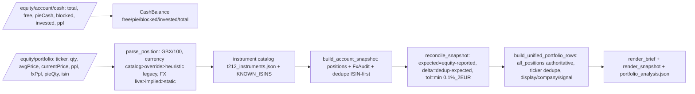
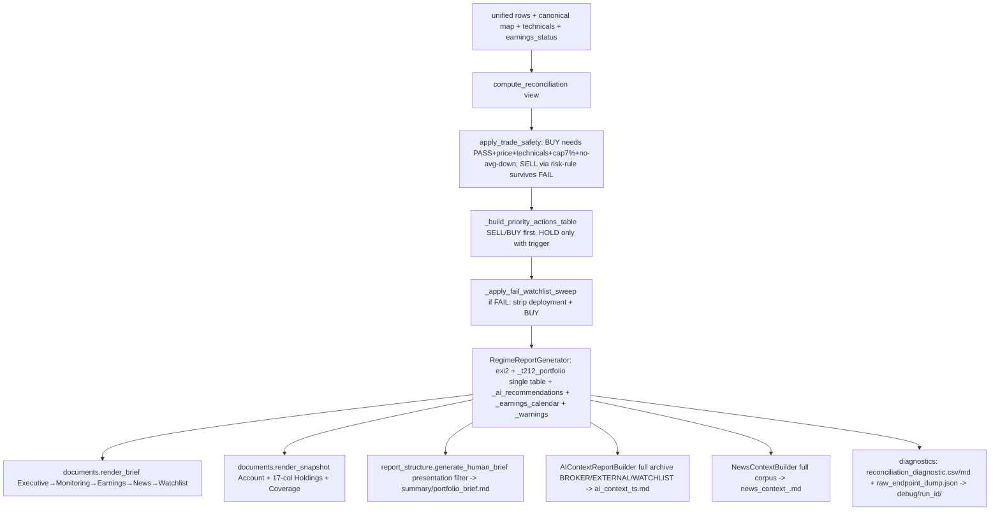
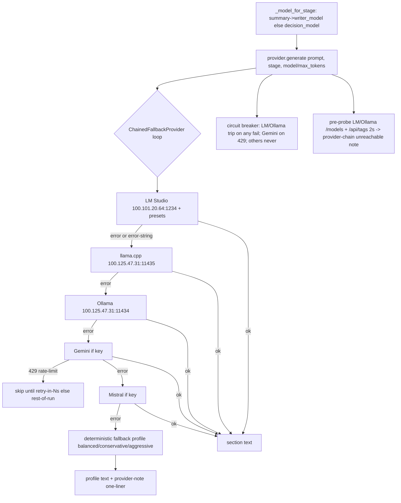
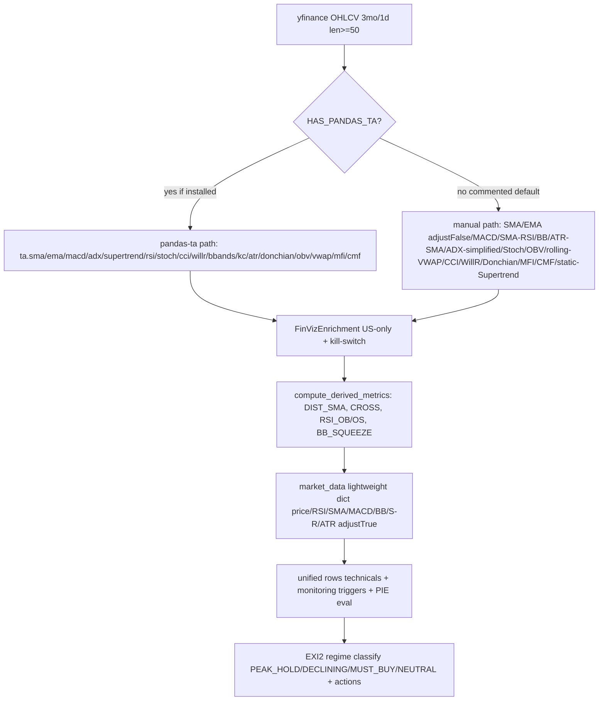
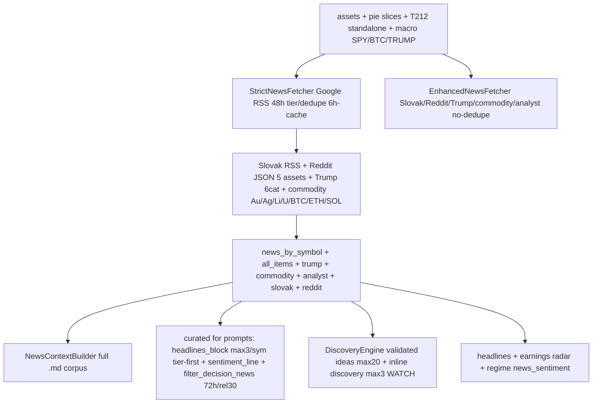
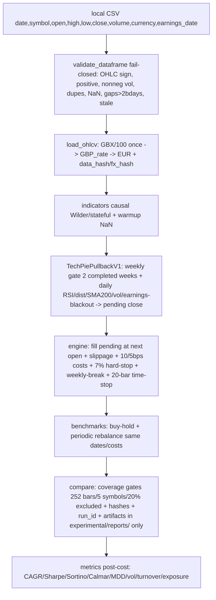

# Runtime Flow

> Read-only. Generated 2026-09-24. Traced from `portfolio_ai_assistant.py` + `investment_engine/main.py:run_engine` + `reporting/*` + providers/research docs. No live run performed; flows verified by code reads + passing offline tests.

## Normal portfolio run

```mermaid
flowchart TD
  A[py -3.12 portfolio_ai_assistant.py] --> B[setup_logging: logs/portfolio_<ts>.log + latest_run.log]
  B --> C[setup_debug_layer run_id: reports/debug/run_id/]
  C --> D[EngineSettings.from_mapping portfolio_config.json]
  D --> E[run_engine assets, portfolio_context{config_path,language,run_id}]
  E --> F[T212 fetch: create_integration api.env -> get_account_summary 20s timeout]
  F --> G[raw diag dump: dump_raw_t212_diagnostics -> reports/raw_endpoint_dump_runid.json]
  G --> H[recon guard: FAIL => suppress account P&L downstream]
  H --> I[news parallel 8+3 workers: Strict + Enhanced + macro + Slovak + Reddit + Trump + commodity + analyst -> news_context_.md]
  I --> J[earnings fast: 15 assets, display keys, timeout 3s each]
  J --> K[EXI2 regime: yfinance 5 TF -> TechnicalAnalyzer -> PeakValley -> FinViz -> news -> RegimeResult]
  K --> L[AI recs JSON: regime+T212+positions -> provider -> parse_ai_recommendations]
  L --> M[canonical signals: build_canonical_signals + HOLD defaults for all_positions]
  M --> N[LLM sections: crypto + tech + renewables + PIE eval + discovery WATCH + summary no-Priority-Actions]
  N --> O[unified rows: build_unified_portfolio_rows + earnings radar + snapshot + reconcile + trade safety + priority table + diagnostics CSV/MD]
  O --> P[FAIL sweep if recon FAIL: watchlist-only summary + monitoring REVIEW]
  P --> Q[regime parts: exi2/portfolio/ai/warnings/earnings -> brief_markdown + snapshot_markdown]
  Q --> R[AI context archive: ai_context_ts.md BROKER/EXTERNAL/WATCHLIST]
  R --> S[return result dict: portfolio_rows, monitoring_items, regime_result, decision_news, earnings_7d, ideas, portfolio_names, ...]
  S --> T[contract check 7 keys -> generate_human_brief -> write_human_brief summary/portfolio_brief.md]
  T --> U[render_failed_tickers_md -> write_reports atomic publish + run_manifest.json + archive copies]
  U --> V[save_ai_context_layer copy -> move_debug_outputs -> LM-Studio unload -> exit 0/1/2]
```

Result dict keys (`main.py:1325-1371`): `brief_markdown, snapshot_markdown, t212_data (sanitized), reconciliation, portfolio_rows, monitoring_items, regime_result, decision_news, earnings_7d, ideas, portfolio_names, ai_recommendations, model_info, brief_metadata, context_file, failed_tickers, news_context_path, ...`. Human-brief contract requires 7 of them (`portfolio_ai_assistant.py:168-177`).

## Trading 212 data path



Critical: `all_positions` (all incl. pie constituents) feeds reconciliation; `positions` (non-pie view) only extends news universe. Pie endpoint totals never summed. `pnl_eur` prefers broker `ppl`. External prices never overwrite broker values.

## Report generation path



Separation: `documents` (source-of-truth curated) vs `report_structure` human filter vs `AIContextReportBuilder` machine archive vs `debug/` internals. Known duplication: two stance functions + duplicated quality-flags collector.

## AI provider fallback path



Notes: explicit `provider=openrouter/mistral/gemini/opencode_zen/ollama/lmstudio` bypasses chain (single). OpenRouter/Zen never in auto. `context[model]` stripped in chain — locals use ctor models. Only LMStudio honors presets/stage sampling. Missing keys skip cloud links. All failures degrade to deterministic text, never abort the run (except contract/exception → exit 1).

## Technical indicator path



Divergences: `adjust True/False`, SMA vs Wilder RSI/ATR/ADX, static vs stateful Supertrend, rolling vs session VWAP, Keltner only in ta-path. Experimental `backtest/indicators` is the correct-reference implementation (Wilder/stateful/strict warmup) — do not compare numbers directly.

## News / research path



Freshness: Strict 48h + decision-filter 72h (looser) + Enhanced HTML-`now()` bug + WebResearcher no-age (unwired) + `market_data` 2d/2-items. X/StockTwits/medical/copper-oil gaps documented in PROJECT_AUDIT.

## Experimental backtest path



Guarantees: no look-ahead (future-bar tests), no network/broker/LLM (import + containment tests), deterministic hashes/byte-identical outputs, fail-closed validation/coverage. Single-period = in-sample; walk-forward future.
